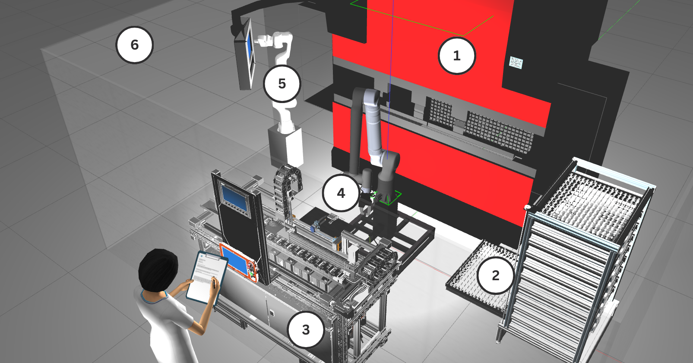
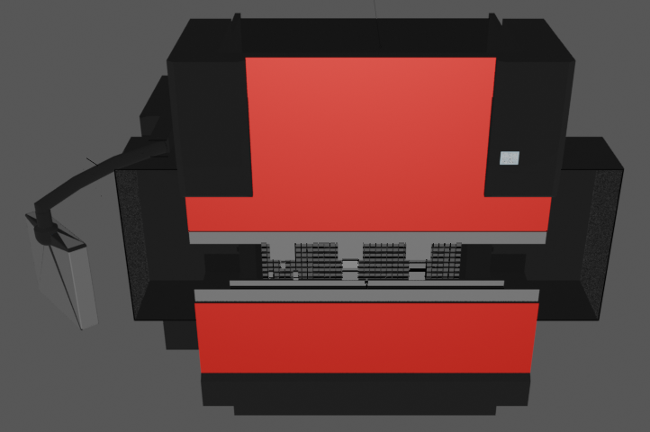
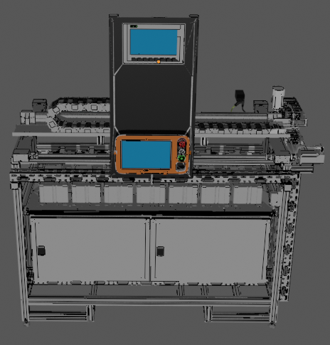
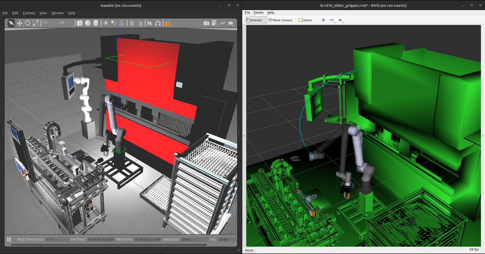
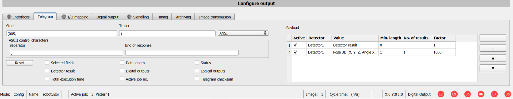
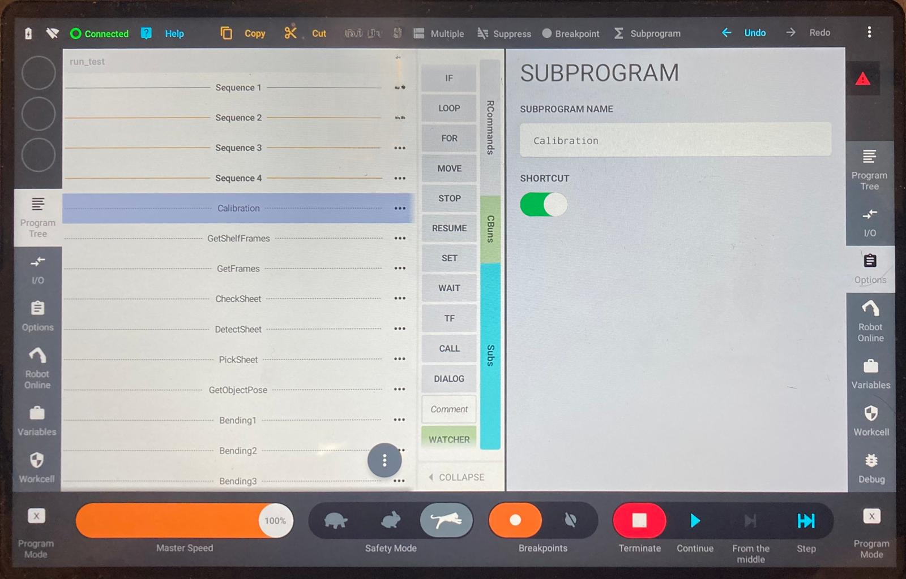
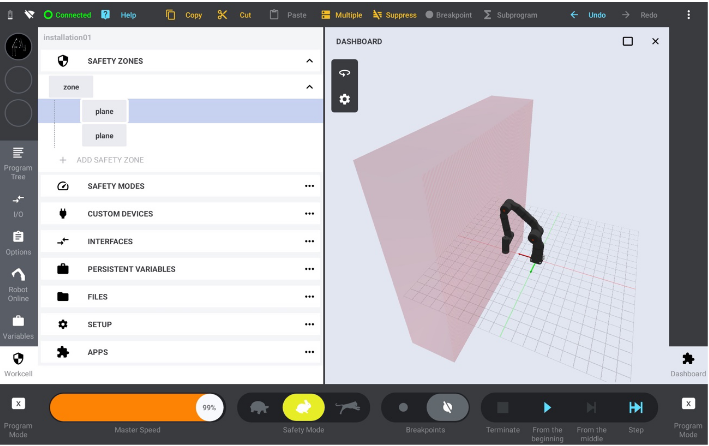
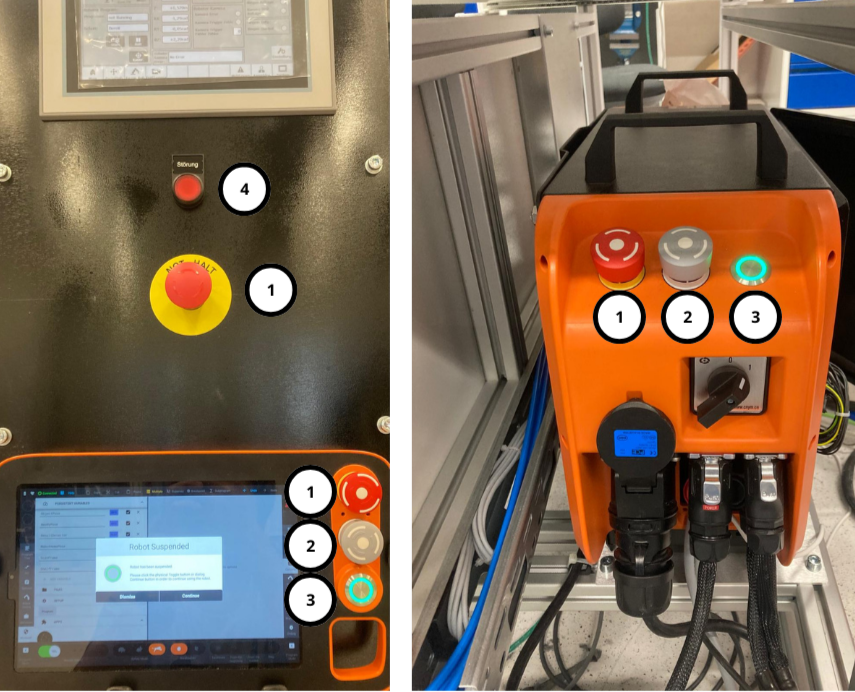
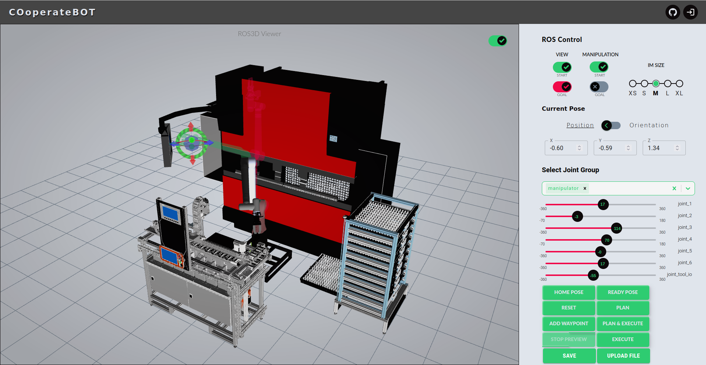
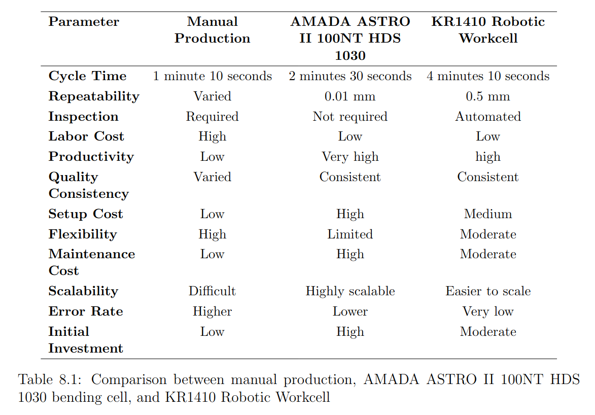

## Robotic Workcell for Automated Bending Process  
**Automating Metal Sheet Bending with Precision**

- Presenter: Shivam Shivam  
- Date: 16 September 2024

---

# Introduction

**Overview:**

- Industry 4.0's impact on manufacturing
- Automation of manual labor in bending processes
- Collaborative robotic systems for bending

<!-- There are nine pillars of technological advancements, namely big data and analytics,
autonomous robots, simulation, horizontal and vertical system integration, the industrial
internet of things, cybersecurity, the cloud, additive manufacturing, augmented reality. -->
---

# Problem Statement & Objectives

**Problem Statement:**

- Manual bending is labor-intensive and prone to human error.
- Automation requires precision in detecting, bending, and handling.

**Objectives:**

1. Develop a robotic workcell for automated bending.
2. Integrate vision sensors for sheet detection and angle measurement.
3. Build a web-based UI for real-time monitoring.

---

# Literature Review

**Key Technologies:**

- Robotic automation in manufacturing
- Evolution of automated bending processes
- Industry 4.0: Cyber-Physical Systems (CPS) and Digital Twins

<!-- *Transition:* Focus shifts to system design and hardware. -->

---

---

# System Design Overview

- Key components: Bending machine, handling robot, storage station, vision sensors
- Simulation with ROS (Robot Operating System) and Gazebo software
- System layout and flow of materials and data

---

# Robotic Workcell Components

**Bending Machine:**

- AMADA HFP80-25 NT for automated bending

**Handling Robot:**

- 7-axis KR1410 for metal sheet handling

**Vision Sensors:**

- Two VISOR® cameras for detection and quality control

---
## Robotic Workcell in simulation

---

---
### Bending machine in blender

---
### Storage station in blender

---
## Unloading station in blender (back view)

---
## Unloading station in blender (front view)

---
## Simulation of KR1410 in gazebo

<!-- ---

---
 -->

---
# Requirements
1. Floor space
2. Operating time
3. handle sheet metal part variants
4. Autocalibration
5. Inspection and corrections in bending

---
# Hardware installation in workcell
- Detector marker
- Bending machine
- Handling robot
- Storage station
- Unloading station

---
## Detection Marker

---
## Bending machine

---
## Bending stations

---
## Handling robot

---
### Storage station

---
## Unloading station

---
##### Inspection camera

---
# Safety Considerations
1. Payload and stopping distance
2. Safety zones
3. Safety Functions
---

## Payload and stopping distance

---
## Safety zones

---
## Safety functions

---
# Software Architechture
- **Simulation Software**: ROS, Gazebo, RViz, MoveIt
- **VISOR Communication Setup**: CBun Device
- **Program Tree**: Teach pendant programming
- **Web UI**: ReactJS, NodeJS, HTML, CSS, Rosbridge, roslibjs, ros3djs, visualization-rwt 
---

# Software Development & UI

- Control software for robotic system
- Integration of ROS with a web-based interface
- **Web UI designing:** Real-time monitoring, robot control, and 3D visualization

---
## Manual Bending process stages

---
## Web Interface Design

---

# System Networking

- **PLC Integration:** Controls for bending machine and communication between the KR robot and cameras
- **Profinet Setup:** Data transfer and synchronization between devices

---

---

---

---

---

# Calibration

- Kinematic and hand-eye calibration for robot and cameras
- Workspace calibration
  

---

---
# Hand-eye calibration graph

---

---

# Integration and Testing

- Testing procedures for sheet pickup, bending, and inspection.
  
<video width="560" height="315" controls>
  <source src="./demo.mp4" type="video/mp4">
  Your browser does not support the video tag.
</video>

---

# Experimental Results

**Key Metrics:**

- Performance evaluation through tests
- Angle measurement accuracy and calibration results
- Bending operation analysis

---

---

---

# Discussion & Future Work

- **Strengths:** High precision, reduced manual labor, flexible configuration
- **Limitations:** Calibration and motion planning challenges, limited memory
- **Future Research:** Software updates for improved handling and real-time feedback

---

# Conclusion

- **Summary:** Automated bending increases throughput, precision, and safety
- **Impact:** Significant improvements in industrial automation

