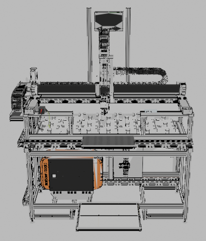
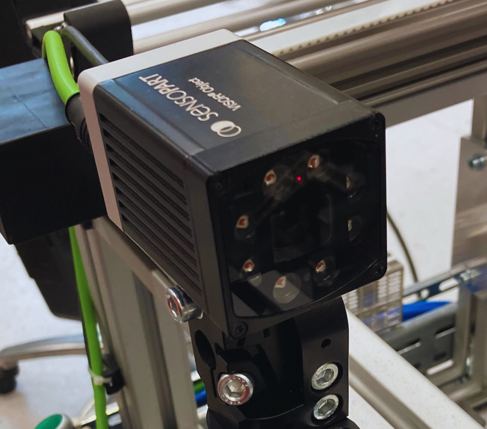
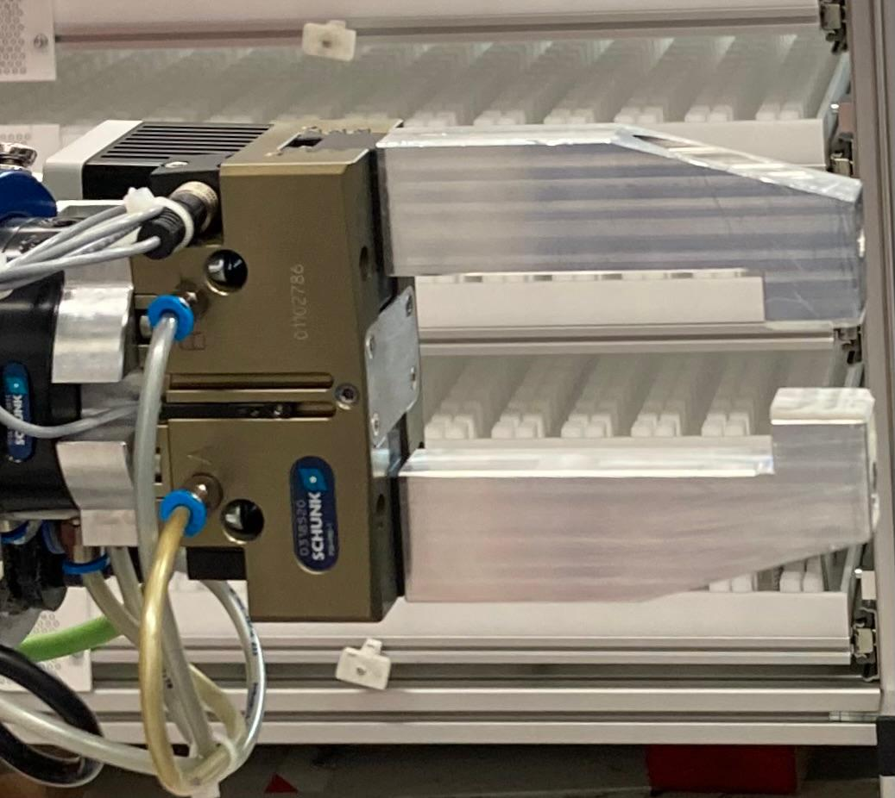
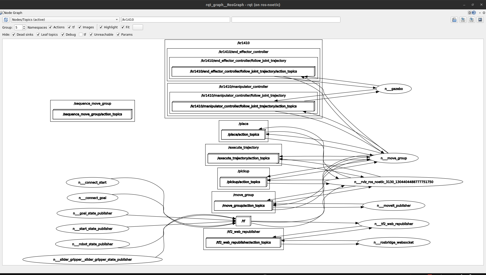
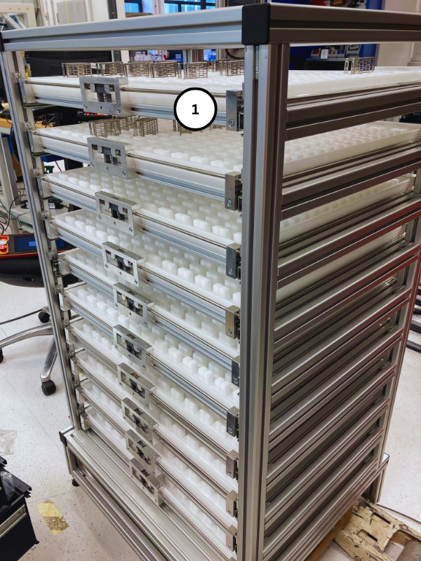
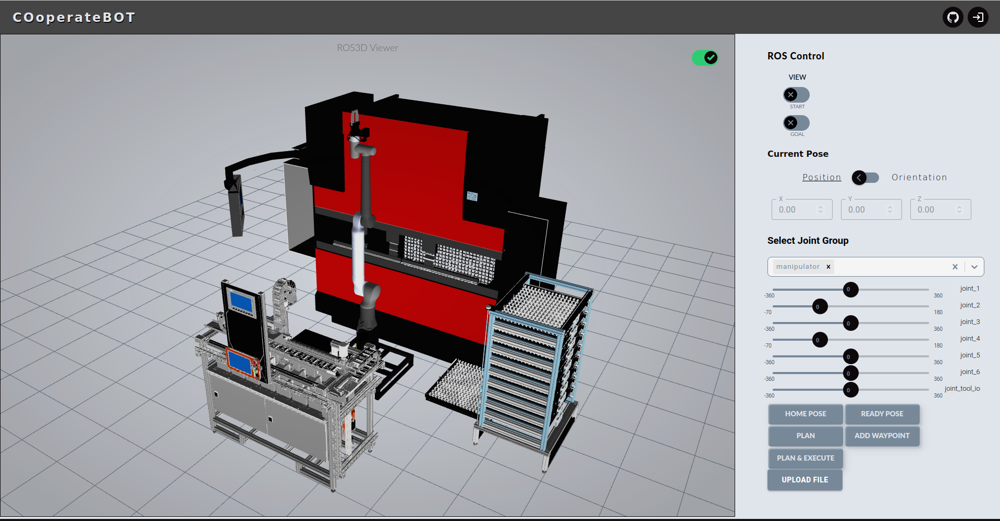
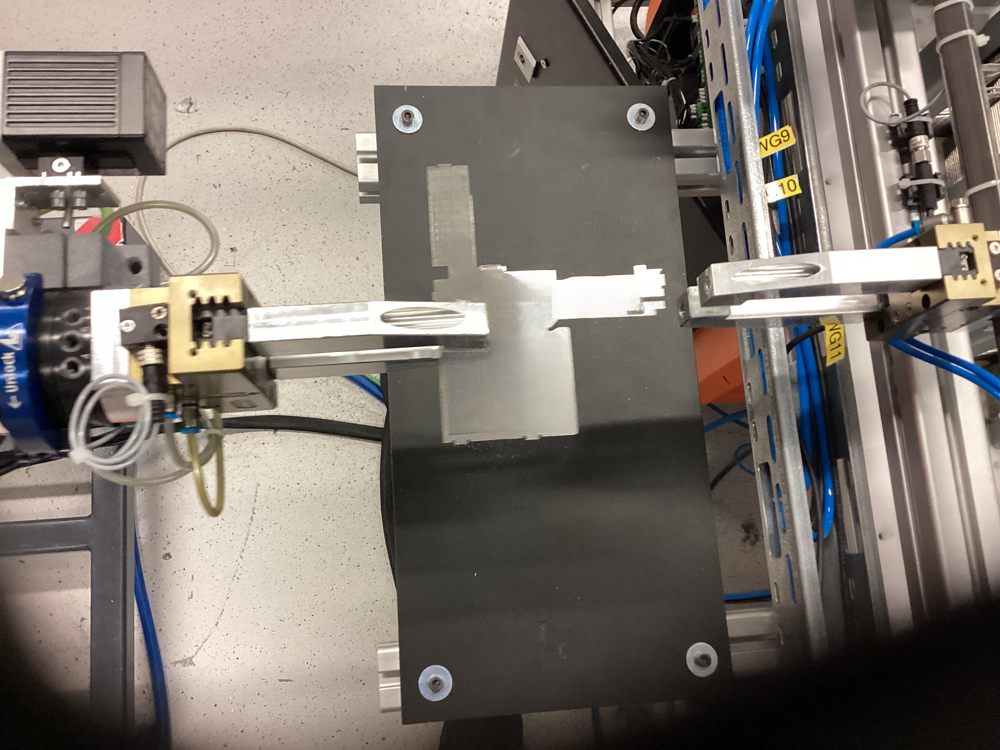

Symbols and Formulas {#symbols-and-formulas .unnumbered}
====================

::: {#tab:symbols}
  Symbol                       Unit         Description
  -------------------- -------------------- ------------------------------------------------------------------------------------------------------------------------------------------------------
  $a_{\text{brake}}$    *$\text{deg/s}^2$*  Braking accelerations on the robot when emergency stop or protective stop is triggered [\[sym:a-brake\]]{#sym:a-brake label="sym:a-brake"}
  $v_{\text{max}}$      *$\text{mm/s}^2$*   linear speed set in the teach pendant of the robot [\[sym:v-max\]]{#sym:v-max label="sym:v-max"}
  $t_{\text{brake}}$           *s*          the braking time of the robot when emergency stop or protective stop is triggered [\[sym:t-brake\]]{#sym:t-brake label="sym:t-brake"}
  $s_{\text{brake}}$           *mm*         the braking distance of the robot when emergency stop or protective stop is triggered [\[sym:s-brake\]]{#sym:s-brake label="sym:s-brake"}
  $\omega$               *$\text{deg/s}$*   Joint speed [\[sym:omega\]]{#sym:omega label="sym:omega"}
  *r*                          *mm*         distance between the shoulder joints of the robot *i.e.* joint axis 1 or 2 and either centre of gravity of load or [\[sym:r\]]{#sym:r label="sym:r"}
:::

[\[tab:symbols\]]{#tab:symbols label="tab:symbols"}

Technical Terms and Abbreviations {#technical-terms-and-abbreviations .unnumbered}
=================================

  -- --
     
     
  -- --

Introduction {#chap:introduction}
============

Background {#sec:background}
----------

The manufacturing sector is driven by the need of increased
productivity. The need for efficiency, precision, safety and cost
reduction has led to significant push towards automation. The industrial
growth is currently pushed by the Industrial 4.0: a fourth wave of
technological advancements that is connecting sensors, machines, and
other systems. These connected systems, also known as cyberphysical
systems, may communicate with one another via common Internet-based
protocols and use data analysis to self-configure, anticipate failure,
and react to changes. Industry 4.0 is making it possible to have
flexibility in production by enabling faster and efficient processes.
[@BAI2020107776; @russmann2015industry]

There are nine pillars of technological advancements, namely big data
and analytics, autonomous robots, simulation, horizontal and vertical
system integration, the industrial internet of things, cybersecurity,
the cloud, additive manufacturing, augmented reality.
[@russmann2015industry]

![Industry 4.0 is changing traditional manufacturing relationships
(Source:
[@russmann2015industry])](1. Introduction/1.1 Background/exhibit2.png){#fig:background-exhibit-2
width="\\textwidth"}

Metal bending processes through an bending machine, used to rely heavily
upon the manual labor traditionally. Industry 4.0 is representing a
transformation from low skill manual labor to a sophisticated system
that requires -related skills and innovation abilities in the workforce.
Robotic Automation would have less variability in product quality and
will not expose operators to physical strain and repetitive motion
injuries. Collaborative robots with vision sensors [@8361333] allows to
have flexibility in manufacturing of metal sheets. It means robot can be
programmed to perform bending of different metal sheets when required.
[@kassowrobotsblog]

Problem Statement {#sec:problem}
-----------------

Manual bending of metal sheets is labor-intensive and can lead to human
errors, resulting in inconsistent quality and inefficiency. The
automation of this process with a collaborative robot poses several
challenges, which includes the precise detection and processing of sheet
metal parts, the accurate execution of the bend operation and the
coordination of the robotic system with other systems in the workcell.

This robotic workcell will have automatic loading and unloading of metal
sheets in the bending machine and will use computer vision to detect and
measure the bend angle of metal sheets. In addition, a user-friendly
interface will be developed for monitoring the robotic workcell.

Objectives {#sec:objectives}
----------

The objectives of this research are as follows:

1.  Designing and developing a robotic workcell capable of bending metal
    sheets autonomously. The workcell includes HFP80-25 NT as the
    bending machine to be automated, as the robot, vision sensors as
    cameras, an unloading station to get sheets from the operator and a
    shelf for placing the sheets.

2.  Integration of computer vision technology to detect metal sheets
    accurately for pick-up and measure bending angle. One vision sensor
    mounted on the will be used for sheet detection and second placed in
    robot workspace for measuring bending angle. Communication between
    the vision sensor and needs to be setup using Telegram.

3.  Building a web interface for the visualization and monitoring of
    robotic workcell in real-time. The web application interfaces with
    the through Bridge library. The interface uses web development
    technologies like , Javascript, and .

4.  Evaluating the efficiency and accuracy of the robotic workcell in
    industrial environments and compare it with already existing
    solution.

Scope {#sec:scope}
-----

The development of robotic workcell that can be rapidly configured has a
major influence on the manufacturing industry. It allows for more
flexibilty and mass customization in production of parts. [@CHEN2001199]
Automating the bending process allows manufacturers to increase
productivity, safety, flexibility, and overall process efficiency while
having the option for customization. [@russmann2015industry page 9]

This thesis contributes to the broadest field of industrial automation
and robotics and shows how Industry 4.0 can transform traditional
manufacturing processes. The scope consists of:

-   Programming control software for the robotic system.

-   Integration of computer vision systems for the detection and
    inspection of metal sheets.

-   Building a web interface for monitoring and visualization.

-   Experimental evaluation of system performance in the industrial
    environment.

The thesis does not discuss other aspects of metal manufacturing or the
integration of other manufacturing processes. The programming of the
second robot i.e. Franka Emika panda robot and in the robotic workcell
is out of scope of this thesis.

Outline of the Thesis {#sec:structure}
---------------------

The thesis is organized into nine chapters: Chapter
[1](#chap:introduction){reference-type="ref"
reference="chap:introduction"} clearly defines the problem statement.
Chapter [2](#chap:review){reference-type="ref" reference="chap:review"}
reviews state-of-the-art technologies in the industry for automation.
Chapter [3](#chap:design){reference-type="ref" reference="chap:design"}
and [4](#chap:integration){reference-type="ref"
reference="chap:integration"} describes the design and development of
the robotic workcell, containing both hardware and software components.
Chapter [5](#chap:development){reference-type="ref"
reference="chap:development"} discusses the programming of the control
software and web interface. Chapter
[6](#chap:testing){reference-type="ref" reference="chap:testing"}
presents the calibration process and evaluation of the entire robotic
workcell using a specimen sheet metal part. Chapter
[7](#chap:results){reference-type="ref" reference="chap:results"}
provides the results and Chapter
[8](#chap:discussion){reference-type="ref" reference="chap:discussion"}
analyzes the results, discusses their implications, and addresses
potential limitations. In the end, Chapter
[9](#chap:conclusion){reference-type="ref" reference="chap:conclusion"}
summarizes the whole thesis and makes suggestions for future research.

Literature Review {#chap:review}
=================

Robotic Automation in Manufacturing {#sec:automation_2}
-----------------------------------

Industrial robots were first used for repetitive tasks and material
handling. The first industrial robot, Unimate was deployed by General
Motors in 1961. It weighed two tons and worked on assembly lines,
autonomously lifting heaving objects and welding car parts. Since then
robots have evolved to become versatile device that can perform complex
tasks, learn from experience, communicate through devices, and
collaborate with human workers. [@firstrobot]

Industrial robots are the right solution for high-volume production
process for their efficiency, uptime and quality. [@jrautomation] As the
manufacturing industry moves smaller batch production, cobots would be
much more useful and flexible in a smart workcell. Cobots are vastly
more advanced and affordable than industrial robots. [@jrautomation2]
Common use cases of robotic automation in manufacturing include material
handling [@gambao2012new; @SKIBNIEWSKI1992251], welding
[@tarn2011robotic], assembly [@ji2021learning], pick-and-place
[@shah2021design], palletizing [@lee2021intelligent], and even metal
sheet bending [@Uhrhan1995].

Automation is particularly useful in industrial where there is a risk
for human operators. In [@10381692], robotic automation has been
implemented for the manufacturing of footwears which is a hazardous
environment for human workers. In it a robotic workcell consisting of
three robots is controlled and coordinated through .

With the , the machines in the robotic workcell communicate and share
data with each other with which production process is improved. Also,
whole production process can be monitored remotely.[@li2020robotics page
105] With the AM technologies, design to production time is vastly
decreased. [@li2020robotics page 116]. The benefits of automation can
often outweigh the initial costs. This way Industry 4.0 is transforming
manufacturing sector.

Automated Bending Processes {#sec:bending_2}
---------------------------

Sheet metal bending is a process in which bends are formed using a
combination of a punch and a die. This process is used to create large
number of mechanical products such as furniture panels, shelves,
cabinets, housing for electro-mechanical devices etc. [@alvaautomated]
The project partner for this thesis *i.e.* **mech-tron GmbH & Co. KG**
excels in the manufacturing of housing systems for electronic and
embedded equipment. In this thesis, manufacturing of one of these sheet
metal housing systems will be automated by means of robotic workcell.

There are various companies in the market which offers automated bending
cells. They use industrial robot to feed and bend the parts in the
bending machine. [@mekoprint; @shenchong; @shopmetal] or systems to
assist the bending which are called *bending followers* and
*sheet-feeder*. [@guimaraes2009bending] However, using a collaborative
robot to perform bending tasks is challenging. A collaborative robot
generally has low payload capacity and requires better robot motion
planning during bending to avoid exceeding joint torques. In
[@liu2022metalwiremanipulationplanning], a cobot is used to collaborate
with a bending machine to perform curving of metal wire and discusses
the difficulties in holding the part in low payload robot gripper during
bending and defines the generation of optimum robot motion considering
the combined task and motion level constraints.

In the article [@cobotfabricator], two cobots from are used for
automated bending. The cobot can perform challenging bend sequences with
the help of a regrip station. In similar way, unloading station is used
for regrasping purposes to change the way the cobot presents the part to
the bending machine.

### ASTRO bending cell {#subsec:astro}

already offers an automated solution for the bending process in means of
a system called ASTRO bending cell. This system consists of a handling
robot which can perform production of smaller, complex workpieces and
have uniformity in production. However, press brake and the know-how of
handling robot come from . The project partner has one of these systems
*i.e.* ASTRO-100 II NT HDS 1030 in their production floor.

![ASTRO-II 100NT HDS 1030 bending cell. (Source:
[@astro100])](figures/ASTRO-100.jpg){#fig:astro width="\\textwidth"}

The ASTRO-100 II NT cell is an "island solution" that is only available
in the HDS-1030 press configuration, ASTRO HP-20 loading and unloading
robot, ASTRO-100 II NT bending robot and the external software ASTRO
CAM. The ASTRO-100 II NT cell. [@astro100] The production using these
system is continous and very fast.

The main drawback of this system is the software ASTRO-CAM, which is
owned by , and offers less flexibility and requires support from for
programming. Without any vision sensors, the system is not smart. It can
perform repetitive tasks very fast and with very little interference
from operator but without any decision making. Also, the ASTRO robot is
non-collaborative and humans cannot work alongside it. It requires a
large area on the production floor which incurs more cost.

In this thesis, this system will be compared to our robotic workcell
solution which has collaborative robot and is more cost-effective.

Robotic System {#sec:robot_2}
--------------

The real benefit of robots is taking over the three Ds, the dull, the
dirty and dangerous jobs. [@jordan2016robots] The functionality of a
robotic system during any step of control should include three principal
performance features in the cognitive process: perception, recognition
and decision making. It is obvious that the autonomy of the whole
robotic system directly corresponds to sensory equipment, processing
sensory information and decision algorithms. [@HAVLIK2011327]

Robots systems are used in industrial environments for assembling parts,
painting cars or welding operations. [@SathishKumar2023; @Wakizako].
Robots could be arranged in assembly lines to carry out a particular
repetitive task. With the development in robotic perception and
algorithms, robotic systems could be placed in a workcell to perform
multiple tasks sequentially. Sensory systems plays an important role to
develop intelligent robotic systems. [@Wakizako]. Using smart sensors, a
single robotic arm could perform various tasks by making decisions.

There are various kind of robotic arms available in the market. These
include industrial robots as well as cobots. Cobots are generally more
sensitive and easier to program. They are also more safe to work with
humans as compared to industrial robots. Industrial robots require an
enclosed space for safety reasons. However, they are more durable and
the speed is high. [@10201199] Robotic arm also comes in different
number of . 6-axis robotic arms are mostly common, but an additional
axis from a 7-axis cobot is advantageous in our case for collision free
trajectory planning in a large workspace.

A good example of cobot is the 7-axis cobot by Kassow Robots. This
sophisticated robot can mimic human movements and offers an extensive
range of motion that allows it to handle intricate tasks, navigate tight
spaces, and maintain consistent product quality in an industrial
setting. These cobots not only increase efficiency and productivity but
also promote safety. They can operate in industrial environments and
reduces the risks associated with humans as they are collaborative. With
the ability to work tirelessly nonstop, theese cobots ensure continuous
production and uniform quality standards. [@kassowrobotsblog]

### Robot Operating System {#subsec:ROS}

The Robot Operating System (ROS) is a set of software libraries and
tools which help to build robot applications. Because it is open-source,
there is flexibility where and how to use ROS, as well as the freedom to
customize if it requires. [@rosblog] ROS is utilized to build, control
or simulate various kind of robots, from mobile robots to robotic arms.
[@koubaa2017robot] It could also be used in partnership with a
simulation environment like Gazebo. This will fasten the development
process and also make decisions before actually buying a robot.

In [@takaya2016simulation], a simulation environment is created for
mobile robots using ROS and gazebo and later tested with the real robot,
showcasing the usability of the ROS for the development process. In
[@qian2014manipulation], a manipulator is simulated for the pick and
place operation. There are numerous robots build using ROS and is used
extensively by both hobbyists and robotic developers and is a powerful
tool.

Computer Vision in Industrial Automation {#sec:CV_2}
----------------------------------------

Computer vision () techniques have played an important role in promoting
the information, digitization, and intelligence of industrial
manufacturing systems. In manufacturing industry, applications include
inspection and quality control, object detection and process control. In
recent years, advancements in camera technology, image processing
algorithms, and techniques have significantly increased the capabilities
of vision systems in manufacturing systems. The most common methods of
are features detection, recognition, segmentation, and three-dimensional
() modeling. [@9761203]

technologies are required for the successful automation of the bending
process. robotic arm should be able to correctly detect and pick metal
sheets and then perform precise bending operations. With , images can be
analyzed in real-time, allowing for feedback and adjustment for the
automated bending process. This capability is necessary to maintain a
high production rate while maintaining good precision. There are many
examples of being used in industrial environments, like in the sorting
and classification of food products
[@BARNES2010339; @THROOP2005281; @BURGOSARTIZZU2010138], monitoring and
safety management of construction projects [@PANERU2021103940] or the
automated traffic monitoring system. [@7892717; @COIFMAN1998271]

The smart extensions of are added to the regular cameras in the
industrial environments, which improves the performance of manufacturing
or other automation processes. [@BREZANI2022298] However, it requires
image processing algorithms to run on separate hardware. The vision
sensor has a processor in its housing and does not require a or to run.
A or laptop is required only in order to configure the vision sensor.
[@visor_user_manual page 23]

User Interfaces for Industrial Systems {#sec:interface_2}
--------------------------------------

Product development process can greatly benefit from the integration of
the digital twin models. According to [@SEMERARO2021103469], digital
twin () embeds a \"virtual\" image of the reality constantly
synchronized with the real operating scenario to provide sound
information (knowledge model) to reality interpretation model to draw
sound decisions.

In manufacturing industry, a digital twin can replicate an individual
machine, a cell, a complete line. Digital twin and virtual commissioning
are two terms that often come when talking about Industry 4.0. Both use
virtual representations of physical systems to save time, enable better
training, and identify improvement opportunities, among other benefits.
However, the digital twin requires a physical equivalent with technology
for data transfer. Virtual commissioning requires simulation of all the
signals with their timings and sensors and actuator responses. It can
exist without a physical system. [@digitaltwinblog]

Digital twin enables the creation of high-performance products and
optimize production systems by allowing early estimations and later
re-configurations. The connectivity of Industry 4.0 technologies is
highlighted as a key strategy for achieving the most efficient product
specifications in technical and economic terms for the manufacturer.
Simulations with a digital production twin open up new possibilities in
production integration. [@WAGNER201988]

In this thesis, virtual commissioning is first accomplished in order to
speed up the development process. The next step is to get the data from
the real robotic system and use it to test and verify the virtual model.
This will be the digital twin model which will help in:

1.  Identify collision points in the real world and use it to plan
    trajectory.

2.  Monitor and optimize the loading and unloading process.

3.  Offer testing opportunities for a new product model.

A functional is required for monitoring and controlling robotic systems.
When envisioning the design principles for , the should be
understandable, reliable and accessible. [@Wilkinson] The should be
designed for an untrained user, offer feedback, have robust error
handling in case of system failure, and usable for users with varying
levels of experience. Web-based interfaces have gained popularity due to
their accessibility and ease of deployment. Versatile and accessible
could be created using web technologies and for robot control. In the
paper [@Xiao_2019], a web-based interface is created that utilizes
alongside , and C++, allows for remote control, real-time monitoring,
and visualization of robots. It uses library to simulate the motion of
the robot on web interface. -based dashboard is also developed for an
autonomous wheelchair using in [@10070046], highlighting the potential
of open source technologies to build a .

System Design {#chap:design}
=============

Overview of the Robotic Workcell {#sec:overview}
--------------------------------

Robotic workcell has to be designed keeping in mind the workspace of
handling robot. Handling robot has to able to reach every station in the
workspace without any collision. The workcell is first developed in
simulation with the use of ROS and gazebo software. This reduced the
development time as it allowed for quick changes to the workcell.

The preliminary designs for the robotic workcell were elaborated in the
form of models and successively converted into final designs. These
models were later converted to suitable file format like *.stl* and
*.dae* for the simulation software . These meshes are then utilized to
build up the whole workcell in and gazebo. Robot is defined in file
format that includes the physical description of the robot. [@urdf] This
simulated environment in gazebo is used to update and fix the final
layout of the robotic workcell. Trajectories are planned to various
subsystems in workcell using to determine to final position of robot in
workcell. Figure [3.1](#fig:robotic-workcell){reference-type="ref"
reference="fig:robotic-workcell"} shows the final layout of the workcell
in gazebo software. It consists of various subsystems which include
bending machine, storage station, unloading station, handling robot,
bending machine terminal operating robot and safety fence.

{#fig:robotic-workcell
width="\\textwidth"}

The subsystems are described in more detail in the following
subsections.

Sheets are loaded by workcell operator in the unloading station. Sheet
metal parts are picked up by the handling robot and taken to bending
machine to perform bending. After all the bending operations are
complete, sheet metal parts are stored in storage station. The relation
between each subsystem and the flow of energy, data, and material is
shown in Figure
[\[fig:flow-workcell\]](#fig:flow-workcell){reference-type="ref"
reference="fig:flow-workcell"}.

### Bending machine {#sub:bending-machine}

Bending machine as a unit comes with a terminal and a foot pedal.
Terminal is used to operate the bending machine for starting, stopping
and configuring the bending machine and also loading the bending
program. Foot pedal comes with two pedals, one for closing the bending
machine and other for opening of the bending machine. Opening and
closing of bending machine is controlled by a foot pedal for the manual
bending operations.

{#fig:bending-machine-blender
width="75%"}

To automated the bending machine, PLC is used to send signals to foot
pedal which in turn, controls the opening and closing of bending
machine.

An inspection camera is also added to measure the bending angle after
each bending operation. This inspection camera is operated by the PLC
and the bending angles are saved in *.csv* file format and displayed on
a HMI.

### Storage station {#sub:storage-station}

The storage station is a shelf with 10 drawers. The drawers of the shelf
can be automatically opened and closed by the handling robot. It is a
mechanical system which is used to store final bended sheet metal parts.

{#fig:storage-station
width="30%"}

When the storage station is full, human operators are to replace a
filled shelf with a new empty shelf with a forklift. Thus, this is the
only station which is not fixed in the robotic workcell. The robotic
camera mounted on the handling robot needs to determine the correct
position of the storage station after each restart.

### Unloading station {#sub:unloading-station}

The task of the removal station is to take a single sheet metal part
from a stack of raw sheets and make it available to the robot unit. This
is a mechatronic system with several different components, which all
have to function individually, but also together in combination. The
mechatronic system is controlled by the PLC.

{#fig:unloading-station-front
width="\\textwidth"}

{#fig:unloading-station-back
width="\\textwidth"}

This unloading station is on top of a cabinet which houses the PLC and
controller of the handling robot.

### Handling robot {#sub:handling-robot}

{#fig:handling-robot-simulation
width="30%"}

Handling robot is the primary robot which handles the sheet metal parts
to different subsystems *i.e.* unloading station, bending machine and
storage station. It coordinates with the PLC to make decisions during
the execution of the program. Reachability is very important in this
case, as it should be able to handle sheet metal parts in any
orientation. A two finger gripper is used for grasping the sheet metal
parts.

To get accuracy with the bending process, detection of features on the
sheet metal parts is required. A robotic camera is mounted of the robot
for this purpose. In this way, handling robot can be trained to operate
with different variants of sheet metal parts.

ROS simulations of the handling robot is done to determine the
performance of robot in the workcell. The drawers of storage system is
especially close to the production floor and the robot requires some
space to move around without getting stuck. Reachability is tested with
the simulation of trajectories before the final integration of the real
robot in the workcell.

### Bending machine terminal operating robot {#sub:panda-robot}

Together with the company **VisCheck GmbH**, an operating unit is
developed for entering parameters on the operating terminal and reading
relevant values on the operating terminal of the bending machine. The
unit consists of a franka emika robot, a camera for reading terminal
values and a computer for controlling the robot. A touch screen pointer
is attached to the gripper of the robot for operating the touch screen
of terminal.

{#fig:terminal-robot
width="30%"}

As it is programmed by another company, it is not simulated in the
software and not coordinated for any trajectory planning. Sufficient
floor space is left near the terminal of bending machine in the robotic
workcell for the installation of this robot. The trajectories of
handling robot are not planned anywhere near this robot. To setup this,
safety zone is created during the programming of the handling robot.

### Safety fence {#sub:safety-fence}

Safety fence marks the boundary of the robotic workcell. Even though the
robot finalized is a collaborative robot, bending machine poses a safety
concern as it is operated automatically by the PLC. The sheet metal
parts are sharp around the corners and when handled by the robot is
deemed as not safe.

Two doors are installed for an entry in the robotic workcell. One is
close to the storage system and is used to move shelf in-and-out of the
workcell by a forklift. The doors are installed with a safety mechanism
by which if the door is open, the whole robot unit and bending machine
cannot operate. This safety mechanism is again controlled by the PLC.
Safety fence is only installed at the end of the project by the company.
A simulation of the fence with ROS and gazebo is not necessary in this
case and is not included as assets in gazebo.

Requirements for the overall system {#sec:requirements}
-----------------------------------

1.  A key requirement for the mobile robot unit is to be able to cope
    with the limited space available in the project partner's production
    hall. Specifically, this means that only an area of approximately
    $2 m \times 4.5 m$ is available in front of the sheet metal bending
    machine.

2.  Another point is the operating time of the overall system. The unit
    should be able to autonomously manage a day shift of eight hours and
    a night shift of six hours without any major personnel intervention.

3.  Robot should also be able to handle various sheet metal part
    variants, i.e. different component sizes and geometries. In addition
    to the flexible handling of different sheet metal parts, the focus
    is also on the simple integration of new variants into the existing
    system. Some of the sheet metal parts in production are of small
    size. These sheets will have little gripping surface after few
    bendings. Special considerations needs to be given to the gripper
    design so that robot can handle sheet metal parts of small and
    medium sizes. (from $60 mm \times 110 mm$ to upto
    $115 mm \times 220 mm$) The sheets should not move in the gripper
    during the movement of the robotic arm.

4.  The mobile robot unit is to be used as a supplement to manual
    production. It is therefore necessary that it can be set up and
    dismantled quickly and easily in front of the bending machine.

5.  The hand-eye calibration using a vision sensor could degrade over
    time due to environmental factors such as temperature changes or
    vibrations. [@Bahadir2024] This will decrease the accuracy of robot
    in positioning and grasping leading to incorrect bending. The robot
    should be able to automatically recalibrate without any long delays
    when there is a request by the operator.

6.  The angle measurement on the bent sheet should be carried out using
    a camera system after each bending process. Based on the measured
    angle, bending machine should be re-adjusted for the next iteration.
    The necessary values should also be entered at the operator terminal
    by the terminal operating robot. In addition, a continuous real-time
    status query of the bending machine is required via the operating
    terminal. For the implementation of this subtask, the company is
    working with **VisCheck GmbH**, which specializes in reading screens
    using a camera and making entries via a robot.

Hardware Selection {#sec:hardware}
------------------

### AMADA bending machine {#subsec:amada}

A bending machine that is manufactured in 2005 and no longer in
production is chosen for this project. The bending machine from AMADA is
a manual hydraulic press brake that is operated by foot pedal. It does
not comes with a system that allows for automated bending process. Table
[3.1](#tab:machine_specifications){reference-type="ref"
reference="tab:machine_specifications"} shows the technical
specifications of the bending machine.

::: {#tab:machine_specifications}
  **Description**               **Value**
  ----------------------------- -----------------------------
  **Model**                     HFP 50-20
  **Manufacturer**              (France)
  **Year of manufacture**       2005
  **Drive**                     Hydraulic press brake
  **Pressing capacity**         500 kN
  **Working length**            2090 mm
  **Distance between frames**   1665 mm
  **control**                   AMADA AMNC -graphic
                                with color screen
  **controlled axes**           Y1/Y2; X1/X2; R1/R2; Z1/Z2
  **Open height**               470 mm
  **Stroke**                    200 mm
  **Bending Speed**             10 mm/s
  **Approach Speed**            100 mm/s
  **Return Speed**              100 mm/s
  **Laser monitoring**          FIESSLER
  **Length x width x height**   3458 mm x 2450 mm x 2450 mm
  **Weight**                    4850 kg

  : Bending Machine Technical Specifications (Source:
  [@bmspecifications])
:::

The AMADA bending machine allows for programming the 5-axis backgauge in
the bending machine. It means for a specific bending operation, the tool
and die the 5-axis backgauge moves in position accordingly and holds the
sheet metal part in place. It is also possible to change bending
operation by selecting the bending operation number from the terminal.
This is done by the controller *i.e.* AMNC of the press brake.

It is also possible to quickly change a tool in the bending machine. It
has a punch holder system which allows quick and secure tool changes.
The hydraulic system provides the force needed for the bending
operations. The hydraulic system does not have any load upto a set point
below which it start bending. This allows for an extremely fast approach
and return speeds. [@amada-machine]

The bending machine has a laser monitoring device as shown in
[4.2](#fig:bending_machine){reference-type="ref"
reference="fig:bending_machine"} This device from **Fiessler GmbH** come
pre-installed with the bending machine and is a press brake safety
measure. It stops the closing of bending machine if a finger or
something else is detected inside the bending machine.

### Kassow Robots: KR1410 {#subsec:kr1410}

KR1410 is a 7-axis collaborative robotic arm from Kassow Robots. It has
a reachability of 1400 mm which fits satisfactory in the workcell. A
seventh axis is particulary useful as it allows more freedom during
trajectory planning especially in close spaces. Five out of seven joints
could do two full rotations.

![Functional parts of the KR collaborative robot (Source:
[@kassow-manual])](figures/kassow-robot-parts.png){#fig:kassow-robot-parts
width="50%"}

The robotic arm comes with a robot controller and a teach pendant as
shown in Figure [3.8](#fig:kassow-robot-parts){reference-type="ref"
reference="fig:kassow-robot-parts"} A robot controller is the main
controlling unit for each manipulator. Teach Pendant is used for
programming the manipulator and also provides and safety controls. The
robot can be operated manually and automatically. It is automated,
programmable and capable of moving in up to seven axes. The robot is
typically used for welding, painting, assembly, pick and place,
packaging and labelling. These are all carried out while ensuring high
endurance, speed, and precision. [@kassow-manual page 23]

  **Description**                  **Value**
  -------------------------------- -----------------------------------
  Type                             Collaborative
  Repeat accuracy                  0.1 mm
  Reach                            1400 mm in all directions
  Number of axis                   7-axis
  Operating temperature range      0-45°C
  Weight                           38.0 kg
  AC Power connector               1 Phase CEE
  Typical Power consumption        400-1200W
  Supply voltage                   100-120 and 200-240 VAC (50/60hz)
  Supply current                   16A
  power supply                     24 VDC
  Max. joint speed                 163/225 °/s
  Max. static force on (payload)   10 kg
  Max. static torque on            25 Nm
  Sound level                      Below 70dB (A)
  Ingress protection               IP54
  Joint ranges                     Joint 1,3,5,6,7 +/- 360°
                                   Joint 2,4 -70/+180°
  Footprint                        $160 \times 160$ mm
  ROS Support                      Available

  : KR1410 Technical Specifications

Kassow Robots can be integrated with other devices via Profinet. Each
robot that is equipped with optional Profinet interface can act as a
Profinet IO-Device. This means that such robot can be monitored and
controlled by any Profinet IO-Controller (for example PLC). [@profinet]
KR1410 could be also interfaced with ROS. KR provides packages to
install through which KR messages communication is set up to a PC. These
messages are used to get the current joint configuration of the robot
and simulate it in ROS or web UI. [@kassow-ros]

KR also provides developmental environment to add new robotic
peripherals, like grippers or sensors. This development environment is ,
which allows writing KR software in C++ for a specific peripheral. It is
used in order to setup communication between VISOR camera functions and
the robot. [@Cbun]

### Camera System: VISOR Vision Sensor {#sec:visor}

According to [@visor_user_manual page 22] user manual, the vision sensor
is an optical sensor and is used for the non-contact acquisition or
identification of objects. The vision sensor features a number of
different evaluation methods (detectors), like contour, pattern
matching, Target Mark 3D, BLOB and others. The vision sensor is a
cost-effective alternative to conventional image processing systems as
discussed in section [2.4](#sec:CV_2){reference-type="ref"
reference="sec:CV_2"} The processing is done inside the camera housing
only. It is a combination of sophisticated hardware and easily
configurable sofware. [@sensopart-visor]

{#fig:vision-sensor
width="50%"}

::: {#visor-technical-data}
  **Description**                     **Value**
  ----------------------------------- ------------------------------------------
  Operating Voltage                   24 V DC (18 V - 30 V)
  Startup time                        $<$ 14 s
  Current consumption                 $\leq$ 300 mA
  Interfaces                          100 Mbit LAN, PROFINET,
                                      EtherNet/IP, SensoWeb
  Weight                              Approx. 200 g
  Ambient air temperature operation   0$^\circ$C - 50$^\circ$C (80 % humidity,
                                      non-condesing)
  Protection Class                    IP 65/IP 67 EN 60529
  Housing Material                    Die-cast aluminium
  Camera type                         V20
  Number of pixels (H $\times$ V)     s 1440 $\times$ 1080
  Sensor size                         1/2.9$^{\prime\prime}$
  Pixel size                          3.4 $\mu$m $\times$ 3.45 $\mu$m
  Technology                          CMOS Mono / Color
  Light type                          LED Red
  Target laser                        Red, laser class 1
  Integrated Lens, focal length       6.5 (Wide)
  Focus (Working distance)            Motorized

  :  Technical Data (Robotic and Object Camera)
:::

vision sensor is a suitable choice for the identification and
classification of metal sheets for the automated bending process. These
sensors enable precise detection and processing of features on sheet
metal parts, which leads to the efficiency and accuracy of automated
bending process. The camera can be connected to a PLC or PC through
ethernet or profinet. The VISOR software is installed on the PC and then
the camera can be configured and jobs can be
added.[@sensopart-software]. A total of 255 jobs with 255 detectors each
can be configured on the camera.

Two camera are selected from SENSOPART. One for the robot which is used
to detect the sheet metal parts and the target mark; and the other for
inspection jobs.

![ V20, Field of view Wide, Internal lens (Source: [@visor_user_manual
page 357])](figures/visor-v20-fov.png){#fig:visor-v20 width="75%"}

#### Robotic Camera {#subsubsec:robotic-camera}

This camera is a Robotic V20 vision sensor with $1440 \times 1080$
resolution, wide lens and a red LED light. [@visor-robotic] A hand-eye
calibration is required in order to transform camera poses to robot
frame. This camera does not use internal illumination to detect objects
as the working distance is 300.0 mm which is large enough for internal
illumination to full brighten the sheet metal part. A tailored interface
is developed for KR teach pendant for this camera to make it communicate
with the robot using CBuns.

#### Inspection Camera {#subsubsec:inspection-camera}

The inspection camera is a V20 Object vision sensor with
$1440 \times 1080$ resolution and red LED light. [@visor-object] This
camera gets the bending angle of the bent sheet metal part. The robot
brings the bent sheet metal parts to the inspection camera. It uses
internal illumination of red light to measure the angle as working
distance is only around 100 mm.

### PLC {#subsec:PLC}

PLC A programmable logic controller (PLC) is a special form of
microprocessor-based controller that uses programmable memory to store
instructions and to implement functions such as logic, sequencing,
timing, counting, and arithmetic in order to control machines and
processes. [@bolton2015programmable page 5] It is an industrial computer
that has been ruggedized and adapted for the control of manufacturing
processes, such as system monitoring, motor control, workcells, or any
activity that requires high reliablity, ease of programming, and process
fault diagnosis. [@ALPHONSUS20161185]

PLC from the manufacturer Siemens are called SIMATIC Controller.
[@siemens] A SIMATIC HMI is also added to the top of front panel of the
unloading station to provide revelant information to the operator as
shown in figure [3.4](#fig:unloading-station-front){reference-type="ref"
reference="fig:unloading-station-front"} PLC is used to manage
everything in robotic workcell, from giving instructions to the KR to
controlling the bending machine and unloading station.

### Gripper {#subsec:robotic-gripper}

The gripper is selected according to payload, gripping force and opening
width. The opening width is the dominant selection criterion here, as
the gripper must be able to grip both the thin sheets with thicknesses
of around 1 to 3 mm and the handle on the drawers with a width of 15 mm.
An electric gripper was considered, as the power supply could have been
provided via the cable already integrated in the robot. Due to the
higher costs, the double height and the weight, a pneumatic gripper was
chosen.

::: {#visor-technical-data}
  **Description**                **Value**
  ------------------------------ -----------------------------------
  Closing Force                  550.0 N
  Stroke per jaw                 8.0 mm
  Min. operating pressure        2.0 bar
  Max. operating pressure        8.0 bar
  Opening force                  610.0 N
  Weight                         0.51 kg
  Opening time                   0.035 s
  Closing time                   0.035 s
  Repeat accuracy                0.01 mm
  Size ($L \times W \times H$)   $96.0 \times 42.0 \times 49.0$ mm
  Min. Ambient temperature       5.0
  Max. Ambient temperature       90.0

  : Schunk gripper technical details (Source: [@schunk-gripper])
:::

{#fig:schunk-gripper width="50%"}

A universal schunk gripper PGN-plus-P 80-1 is chosen which is a 2-finger
parallel pneumatic gripper with permanent lubrication, high gripping
force, and high maximum moments due to the use of a multi-tooth
guidance. [@schunk-gripper] It is also possible to know if the gripper
is open or closed because of a sensor inside the housing of gripper.
This value of sensor is sent to the PLC to detect if the gripper is
closed.

#### Robotic Gripper {#subsubsec:robotic-gripper}

The robotic gripper is mounted on the KR1410. This gripper is used for
grasping the sheet metal parts, perfrom bending operation and opening or
closing the drawers of shelf.

#### Unloading Station Gripper {#subsubsec:unloading-gripper}

The pneumatic parallel gripper is mounted on the pneumatic swivel unit
which can turn 180. This allows the transfer the sheet metal part from
unloading station to the robotic gripper.

Software Architecture {#sec:software}
---------------------

To find out the software version and development environent used in the
development of the workcell, check the appendix
[10.1](#sec:versions){reference-type="ref" reference="sec:versions"}.

### Simulation Software {#subsec:simulation-software}

Before building the robotic workcell in the real world, the kassow robot
is simulated in the ROS and gazebo software environment.

#### ROS {#subsubsec:ROS}

For more information on ROS, see section
[2.3.1](#subsec:ROS){reference-type="ref" reference="subsec:ROS"}. A
URDF model of the KR1410 with gripper attached is created complete with
all positions of links, joints, sensors, models etc. This URDF
description of robot is then ready to be tested in the workcell. Few
open-source additional packages were also used for building this
simulation. For example, for attaching an object to the finger joint
which simulates a grasping action in gazebo simulator. [@gazebo-pkgs]

The robotic motion of unloading station gripper and the manipulation of
KR1410 using the robotic gripper is simulated using ROS. (See Figure
[3.13](#fig:gazebo-rviz){reference-type="ref"
reference="fig:gazebo-rviz"})

{#fig:rosgraph width="\\textwidth"}

Many custom ROS packages [@rospackage] are created to simulate the
workcell. A single ROS launch [@roslaunch] file is launched to run every
node [@rosnode], service [@rosservice] and parameter [@parameterserver]
or action servers [@actionserver] Figure
[3.12](#fig:rosgraph){reference-type="ref" reference="fig:rosgraph"}
visualizes the computation graph of the simulation. It shows the
currently active ROS nodes [@rosnode] and topics [@rostopic] in the
simulation of robotic workcell.

#### Gazebo Simulator {#subsubsec:gazebo}

Gazebo is a 3D dynamic simulator with the ability to accurately and
efficiently simulate populations of robots in complex indoor and outdoor
environments. While similar to game engines, Gazebo offers physics
simulation at a much higher degree of fidelity, a suite of sensors, and
interfaces for both users and programs. [@gazebo-classic]

A model of the entire workcell is created for the gazebo simulator. The
assets are converted from CAD designs to .dae and .stl file format using
blender software. These meshes are then included in the SDF model
object. The workcell is then ready to be simulated in the gazebo
simulator.

{#fig:gazebo-rviz width="\\textwidth"}

#### RViz {#subsubsec:RViz}

RViz is short for ROS Visualization. It is a 3D visualization software
tool for robots, sensors, and algorithms. It allows seeing the robot's
perception of its world (real or simulated). The purpose of RViz is to
visualize the state of a robot. It uses sensor data to try to create an
accurate depiction of what is going on in the robot's environment.
[@rviz]

#### MoveIt {#subsubsec:moveit}

MoveIt is a software for ROS used for manipulation, motion planning, 3D
perception, kinematics, control and navigation. [@moveit] MoveIt is used
to get the solve the kinematics of the 7-axis kassow robot and do
robotic manipulation and perception. A collision mesh of the workcell is
published in the planning scene as can be seen in RViz in Figure
[3.13](#fig:gazebo-rviz){reference-type="ref"
reference="fig:gazebo-rviz"}. This makes the KR1410 to plan trajectories
without any collision in the workcell. The robotic gripper is also
controlled using MoveIt package.

### VISOR Communication Setup {#subsec:computer-vision}

VISOR software is not officially supported by the KR1410 and there is no
direct integration of the VISOR camera available. However, Kassow robots
provides support to build own software through CBun development. The
CBun (Capability Bundle) represents a modular framework within the KR
software system, which encapsulates functionalities and provides the
access to its predefined .

{#fig:sensopart-development
width="50%"}

The CBun SDK is the Software Development Kit that provides all essential
tools for CBun development. The project setup is created in a Visual
Studio Code container running on Ubuntu 18.04 with a special set of
software packages. [@Cbun] The header files are located in **include**
directory and C++ source file *i.e.* *VISOR\_Communication.cpp* are
placed in **src** directory. Upon building the project, a
*SENSOPART.cbun* file is generated as shown in
[3.14](#fig:sensopart-development){reference-type="ref"
reference="fig:sensopart-development"} It is then installed in the teach
pendant using a .

{#fig:visor-communication
width="100%"}

CBun device is one of the CBun elements. CBun Device concept allows to
wrap handling code of physical device like VISOR vision sensor into the
CBun and hide it from the end user. This allows the user to simply
control and monitor devices without the need to implement the
communication and logic. [@cbun-device]

VISOR camera is powered from the TPSU02 on the KR1410 tool-IO. A CBun
device named **VISOR** from CBun developement is created which has
methods for controlling the functionalities of camera like changing job,
getting object pose by triggering camera and performing calibration.
Through this device, the KR communicates with the VISOR over telegram.
Figure [3.15](#fig:visor-communication){reference-type="ref"
reference="fig:visor-communication"} shows the setup of telegram with
the correct start, trailer and separator characters, and also the
transfer of data which only happens in the format of one integer and one
pose value. The integer value is used for now to determine if the camera
has detected the object while the pose value is used to send the pose of
the detected object. Integer value of 1 means the camera has detected
the object and 0 means not detected.

### Program Tree {#subsec:program-tree}

Kassow Robots teach pendant is a graphical user interface which allows
users to control robot arm and HW equipment, build and run programs and
configure robot installation setup. It is intended to be intuitive as it
comes with familiar design of a tablet. The main screen interface is
based on a double pane layout between which there is a command box. The
command box provides access to basic building blocks, loaded CBun
devices, and subroutines defined by the operator. These commands can be
dragged and dropped into the program tree. [@kassow-software-manual page
15] There is a control mode in the bottom which can set the master speed
or launch the program and control the execution process. (pause,
continue, terminate). The program tree view is where the robot program
is built in an intuitive graphical way. A program tree contains atleast
one sequence. A sequence contains a number of commands that are executed
sequentially. For separate sequences, the commands are executed
simulataneously and asynchronously. [@kassow-software-manual page 20]

{#fig:programtree width="\\textwidth"}

The programming of KR1410 is done in the program tree for one sheet
metal part variant. It is done so as to test the bending process using
the KR1410. The program tree of the workcell consists of four sequences
which runs in parallel. Sequence 1 is the main program which runs all
the pick-place and bending operations. Sequence 2 and 3 looks for a
signal from PLC for pausing and terminating the current program
respectively. Sequence 4 controls the robotic and unloading station
grippers using a push button for manual operation of the gripper in case
of emergency.

The robot is programmed using a number of subprograms such that a
subprogram can be quickly imported in the sequence and is intuitive to
understand as shown in figure
[3.16](#fig:programtree){reference-type="ref"
reference="fig:programtree"} Besides normal RCommands like IF, LOOP,
FOR, MOVE, WAIT and so on, there are a number of CBun devices from
Kassow Robots imported like the IK, FK and WATCHER devices. IK is used
to get the inverse kinematics from a pose and FK is used to get the
forward kinematics from a joint configuration. Custom made Cbuns modules
for VISOR are also used for auto-calibration and for getting the pose in
the robot frame of a detected object in the workspace using the VISOR
vision sensor.

### Web UI {#subsec:web-ui}

#### Front-end technologies {#subsubsec:frontend}

Front-end development is the development of visual and interactive
elements of a website that users interact with directly. It's a
combination of HTML, CSS and JavaScript, where HTML provides the
structure, CSS the styling and layout, and JavaScript the dynamic
behaviour and interactivity. [@frontend]

##### Reactjs {#par:reactjs}

is the most popular front-end JavaScript library for building user
interfaces. React can also render on the server using Node and power
mobile apps using React Native. It user interfaces out of individual
pieces called components written in JavaScript. [@reactjs]

#### Backend technologies {#subsubsec:backend}

Backend development refers to the server-side aspect of web development,
focusing on creating and managing the server logic, databases, and APIs.
It involves handling user authentication, authorization, and processing
user requests, typically using backend development languages such as
Python, Java, JavaScript (Node.js), and .NET. [@backend]

##### Node.js {#par:nodejs}

is an open-source, cross-platform JavaScript runtime environment that
lets developers create servers, web application etc. The web application
for robotic workcell is built and hosted on a Node.js server. [@nodejs]

##### npm {#par:npm}

is a package manager for Node.js. It stands for Node Package Manager.
Through this, ROS web tools for server-side runtime are installed like
roslib, ros3djs. [@npm]

#### ROS Web Tools {#subsubsec:rosweb}

Robot Web Tools are open-source libraries and tools for building
web-based robot apps with ROS. Rosbridge, roslibjs, ros3Djs, and
visualization-rwt packages are used for building the web application
which are part of ROS Web Tools. [@webtools] Rosbridge and
visualization-rwt are installed on the ROS workspace for robotic
workcell. Roslibjs and ros3Djs are libraries for building the web
application and are installed on the server built on Node.js.

##### Rosbridge {#par:rosbridge}

The WebSocket makes it possible to open a two-way interactive
communication session between the user's browser and a server. With this
API, messages can be sent to a server and received through event-driven
responses without having to poll the server for a reply. [@websocket]
Rosbridge provides a websocket interface to ROS systems. It will provide
interface to front-end technologies like ReactJs which builds the UI and
publishes a web application. Rosbridge suite is a meta-package
containing rosbridge, various front end packages for Rosbridge like a
WebSocket package, and helper packages. [@rosbridge]

##### roslibjs {#par:roslibjs}

provides base dependencies and support libraries for ROS. roslib
contains many of the common data structures and tools that are shared
across ROS client library implementations. [@roslib] It will provides
support to interact with basic ROS functionalities like topics,
services, parameter servers and others.

##### ros3djs {#par:ros3djs}

is the standard JavaScript 3D visualization manager for ROS. It is build
ontop of roslibjs and utilizes the power of three.js [@threejs]. Many
standard ROS features like interactive markers, URDFs, and maps are
included as part of this library. [@ros3djs]

##### visualization-rwt {#par:visualization-rwt}

package is a suite of nodes for web based robot visualization. It
provides nodes for controlling the robot using MoveIt through web
application. [@visualization-rwt]

Hardware Integration {#chap:integration}
====================

Installation and Configuration
------------------------------

After testing and simulating the system design in the simulation
software, construction and installation of individual systems begin.
This section explains the installation and configuration of each system
with their individual components, while also explaining their
functionality.

### Detection marker {#subsec:marker}

Detection marker is a $15\times13$ 200 mm pattern that is used to
determine the pose of a system placed in the workcell using the vision
sensor mounted on the KR. The pose represents the position and
orientation in 3D space. In total, there are ten markers in the robotic
workcell. One each for bending machine unit and unloading station; and
ten markers for the storage station.

{#fig:marker
width="50%"}

In addition to get the pose, detection marker is used as calibration
plate for auto calibration of camera *w.r.t.* .

### Bending machine unit {#subsec:bending-machine}

Bending machine is set to operate automatically by controlling the foot
pedal with . To automate the bending process, several devices and
components are installed on the bending machine. Bending machine is
operated freely upto a certain point *i.e.* without any pressure and
only starts applying pressure when it is in contact with the sheet metal
part. Figure [4.2](#fig:bending_machine){reference-type="ref"
reference="fig:bending_machine"} shows these components.

#### Marker {#subsubsec:marker}

Detection marker mounted on the bending machine. This pose is used as
reference frame for all three bending stations. Since the bending
machine is fixed, this marker is also used for auto calibration of the
robotic camera.

{#fig:bending_machine
width="100%"}

#### Bending machine open height measurement sensor {#subsubsec:laser-sensor}

It is important to know exactly the current open height of the bending
machine. This value tells the KR to open the pneumatic parallel gripper
as sheet starts bending at a bending station to avoid any deformation in
the sheet. Once the bending is complete, the KR can move out safely
without any collision if a set-point on the open height is reached.

For this, a laser sensor is mounted on the bending machine which
measures the open height of the bending machine. The sensor values are
sent to the PLC. KR makes decision to do bending operation based on this
laser sensor value.

#### Bending station {#subsubsec:bending-station}

There are three bending stations in the bending machine. Each bending
station has a different set of punch and die. Bending station 1 is used
to achieve a bending of 90. Bending station 2 bends the sheet metal part
at an angle of 135. And finally, bending station is used to press down
the sheet and make it flat.

{#fig:bending-station
width="70%"}

These three stations are enough for the sheet bending operation. KR1410
will take the sheet metal part to one of these bending station to
perform a bending of a particular angle. A sheet metal part could
require the use of one or more of these bending stations.

#### Terminal Fixture

The bending machine comes with a terminal which is used to operate the
bending machine. However, this terminal is free to rotate and move. It
is required to fix the movement of terminal, so that terminal operating
robot could operate reliably. The fixtures made from aluminium profiles
fixes the bending machine terminal.

### Robot unit {#subsec:robot-unit}

The robot unit consists of three assemblies: a base, a robot and an
end-effector. (Figure
[4.4](#fig:robot-installation){reference-type="ref"
reference="fig:robot-installation"}). The robot is a manipulator from
kassow robots with pneumatic parallel grippers as the end-effector.
Pneumatic gripper is controlled by PLC. camera is also mounted on the
tool-IO which is used for robotic perception.

{#fig:robot-installation
width="100%"}

#### Robot base

The base is a simple welded construction made of steel. The choice of
steel material ensures that the base has sufficient dead weight so that
it can be transported together with the robot and gripper using a pallet
truck without the risk of tipping over. During operation, the robot unit
is fixed to the floor with four M12 screws.

#### KR1410 manipulator

The robot used is a 7-axis robot from Kassow Robots with model KR1410.
This robot model fulfills the requirements defined in the section
[3.2](#sec:requirements){reference-type="ref"
reference="sec:requirements"}. Simulations have shown that this robot is
above to reach even the lowest drawers of the shelf of the storage
station. Two full rotations (720) of five out of seven joints allows
complex motions in limited space. A flexible conduit containing
pneumatic hose for the pneumatic parallel gripper and communication
cabel for the camera goes around the manipulator to reach the
end-effector.

#### Manual quick-change system

The gripper is attached to a manual quick-change system. The manual
quick-change system makes it possible to exchange different gripper
designs in a short time and without increased effort if required for a
sheet metal part type. Sheet metal part is folded into something like a
box. The quick-change system also has an electric and pneumatic power
feed-through, which ensures simple, user-friendly changeover.

#### Robotic Gripper {#robotic-gripper}

The gripper is a Schunk pneumatic parallel gripper. It is powered and
controlled by the Tool-IO board on the KR1410. The robotic gripper grips
an object with an applied pressure of five bar. This is enough to hold
the sheet metal part in place during motion of the arm. The fingers are
made from aluminium material and finger tips are 3D printed using a
printer. The tips are worn out after some period of time, but are easily
replacable by 3D printing. In the program tree, the center of finger
tips sets the for the robot and is 216 mm from the .

#### Robotic Camera {#robotic-camera}

A camera system is installed on the robot itself. This is used to
determine the relative position between the robot unit and the unloading
station, bending machine and storage station using the markers and
between the robot unit and the sheet metal part (when it is first made
available at the unloading station or is gripped) using features on the
sheet metal part. As the working distance of this camera is large
*300mm*, using external light source is required to protect against
ambient light. This is because light reflections or changing extraneous
light can distort evaluation results.

### Storage station {#subsec:storage-station}

The storage station is a shelf of 10 drawers and is constructed entirely
from aluminum profiles. At the heart of the storage box are the modular
drawers, which consist of a universal basic construction and individual
sheet metal part support plates. The basic construction consists of an
aluminum profile frame, two telescopic rails and a locking mechanism,
which prevents the drawer from moving unintentionally when pulled out or
pushed in. Due to the greater need for profiles and connection
technology, the costs for this construction method are somewhat higher,
but the storage box can be manufactured precisely as a result, which
will have a positive effect on process reliability later when the sheet
metal parts are stored.

{#fig:storage-station-main
width="\\textwidth"}
[\[fig:storage-station-front\]]{#fig:storage-station-front
label="fig:storage-station-front"}

{#fig:storage-station-back
width="\\textwidth"}

The individual drawers could be pulled out using telescopic rails
automatically by the robot. The individual drawer is a 30 mm thick plate
with regularly arranged recesses, which enables the finished sheet metal
parts to be placed in a defined position for the robot unit. For weight
reasons, plastic was the only material considered and the drawers are
printed using . Due to the possibility of customizing the sheet metal
part carrier plate, the focus of the design implementation was on
designing a carrier plate that can be used for several sheet metal part
variants at the same time. On the one hand, this saves material
resources, and on the other hand, different sheet metal part carrier
plates do not have to be kept in stock or the storage boxes do not
always have to be converted when changing products.

Each drawer has its own locking mechanism. This is operated with a
handle on the front by turning it clockwise or anticlockwise. The handle
also serves as a gripping object for the robot unit, by means of which
the drawer can be pulled out or pushed in. In addition to this locking
mechanism, each storage box has a locking bar across all drawers. This
is intended to serve as an additional safeguard when the boxes are moved
between different factory halls and/or over longer distances using a
forklift truck. In addition, each individual drawer is equipped with a
detection marker pattern that is used to determine the spatial position
using the camera on the robot unit. This is required for the reliable
depositing of the sheet metal parts.

### Unloading station {#subsec:unloading-station}

Figure
[\[fig:unloading-station-main\]](#fig:unloading-station-main){reference-type="ref"
reference="fig:unloading-station-main"} shows the elementary components
of this station.

System Networking
-----------------

PLC is used to control the subsystems in the robotic workcell. PLC
controls the bending process by controlling the bending machine,
operates the unloading station to get new sheet metal parts to the
unloading station gripper using the gantry robot, triggers the
inspection camera for testing the bending process and cooperates with
the KR1410 to select the correct bending task. To achieve all of this,
communication needs to be setup between various subsystems. Figure
[\[fig:communication-protocols\]](#fig:communication-protocols){reference-type="ref"
reference="fig:communication-protocols"} shows the networking diagram
between various devices in the workcell. ROS PC has not been
commissioned in the robotic workcell, but a setup could easily be made
by connecting an ethernet cable between robot controller and laptop.

::: {#tab:kr1410-to-plc}
  **Input Register**   **Function**
  -------------------- -------------------------------------------
                       
  Bit\[0\]             open or close unloading station gripper
  Bit\[1\]             open or close robotic gripper
  Bit\[2\]             bending start request/release
  Bit\[3\]             inspection camera trigger request/release
  Bit\[4\]             robot active
  Bit\[5\]             sheet request
                       
  **Int\[0\]**         **Current robot state in program**
  Int\[0\]=0           Not ready or failure
  Int\[0\]=1           getting to ready pose
  Int\[0\]=2           waiting for new sheet
  Int\[0\]=3           performing bending operation 1
  Int\[0\]=4           performing bending operation 2
  Int\[0\]=5           performing bending operation 3
  Int\[0\]=6           performing bending operation 4
  Int\[0\]=7           performing bending operation 5
  Int\[0\]=8           performing bending operation 6
  Int\[0\]=9           placing sheet metal part in shelf
  Int\[0\]=10          performing calibration
  **Int\[1\]**         **Robotic camera trigger state**
  Int\[1\]=0           no trigger
  Int\[1\]=1           successful, object detected
  Int\[1\]=2           failure, object not detected
  **Int\[2\]**         **Robotic camera operation state**
  Int\[2\]=0           Working
  Int\[2\] is not 0    Not working, camera restart required

  : Sending data from KR1410 to PLC over Profinet
:::

::: {#tab:plc-to-kr1410}
    **Output Register**    **Function**
  ------------------------ --------------------------------------------
                           
   **Bit\[0\]-Bit-\[7\]**  **trigger for bending machine reaching a**
                           **certain open height value determined**
                           **using laser sensor**
          Bit\[0\]         Bending operation 1 started
          Bit\[1\]         Bending operation 2 started
          Bit\[2\]         Bending operation 3 started
          Bit\[3\]         Bending operation 4 started
          Bit\[4\]         Bending operation 5 started
          Bit\[5\]         Bending operation 6 started
          Bit\[6\]         Bending finished, take out sheet
          Bit\[7\]         Bending machine fully open
          Bit\[8\]         Start bending sequence program
          Bit\[9\]         Sheet metal ready in unloading
                           station gripper
         Bit\[10\]         Correcting bending machine sequence
                           using terminal robot
         Bit\[11\]         Inspecting requested
         Bit\[12\]         Pause program
         Bit\[13\]         Calibration requested
         Bit\[14\]         Terminate program
         Bit\[15\]         Storage station secured
                           
        **Int\[0\]**       **Inspection Results**
         Int\[0\]=0        Waiting for results
         Int\[0\]=1        Successful
         Int\[0\]=2        Failure

  : Sending data from PLC to KR1410 over Profinet
:::

### Communication between KR1410 Robot and PLC

The communication between the PLC and KR1410 is established over
Profinet, a leading industrial ethernet protocol for communication
between devices in industrial automation systems. Profinet (usually
styled as PROFINET, as a portmanteau for Process Field Net) ensures
real-time data transmission and supports various network topologies.
[@profinet]

A number of robot data can be monitored and controller through PLC over
Profinet. These include monitoring of system state, joint configuration,
TCP kinematics, IO Board, Tool IO state, and controlling of master
speed, IO Board, and Tool IO outputs. The profinet also allows the
transfer of data from Robot to PLC over user defined 64 Bit Input, 24
Int Input, 24 Real Input and from PLC to Robot over 64 Bit Output, 24
Int Output and 24 Real Output. [@kr-profinet] Table
[4.1](#tab:kr1410-to-plc){reference-type="ref"
reference="tab:kr1410-to-plc"} and
[4.2](#tab:plc-to-kr1410){reference-type="ref"
reference="tab:plc-to-kr1410"} shows the defined variables for
cooperation between PLC and KR1410 which are shared over profinet.

### VISOR Communication Protocols

Both VISOR camera has been configured beforehand for camera settings
like shutter speed, gain, working distance, resolution, internal
illumination and other parameters. VISOR has been connected to a PC
running SensoConfig software from SENSOPART for configuring the camera.
Using this software, separate jobs could also be added for each task.
The task could include detecting a particular sheet pattern, target
marker detection or bend angle measurement. CBun **VISOR** device added
to KR teach pendant only allows switching of jobs, triggering camera,
performing calibration and a few other tasks. But training to recognise
a pattern needs to be done beforehand using a PC.

#### VISOR to KR1410

Kassow robot is interfaced to the robotic camera using ethernet. CBun
Device installed on KR teach pendant allows for communication between
Kassow robot and the VISOR. It is build and installed using CBun
development as mentioned in subsection
[3.4.2](#subsec:computer-vision){reference-type="ref"
reference="subsec:computer-vision"}. The following ports are used for
communications between the Kassow Robot and the VISOR.

-   **Port 2005**, Transmission control protocol TCP (Implicit results,
    *i.e.* user-configured result data)

-   **Port 2006**, Transmission control protocol TCP (Explicit results,
    *e.g.* trigger or job switch)

{#fig:cbun-variables
width="55%"}

Figure [\[fig:calib-graph\]](#fig:calib-graph){reference-type="ref"
reference="fig:calib-graph"} shows the use of this communication setup
to perform auto-calibration with the Kassow robots and the mounted
camera.

#### VISOR to PLC

PLC is interfaced with the inspection camera using Profinet. UDP (User
Datagram Protocol) is used over ports 161, 34962, 34963, 34964 to
establish communication between the PLC and the VISOR.
[@visor_communication_manual]

### Communication between KR1410 Robot, ROS and Web UI {#subsec:KR1410ROS}

The communication between the Web UI and the nodejs server happens via
HTTP for standard page loading. The websocket connection through
rosbridge provides real-time, bidirectional data exchange between the
real or simulated robot and the web interface. This allows
visualization, monitoring and also control of the robot through web
application. Figure [4.9](#fig:ros-web-graph){reference-type="ref"
reference="fig:ros-web-graph"} shows the communication diagram between
ROS, Web application and the KR.

{#fig:ros-web-graph width="100%"}

Web UI is build using the frontend development tool ReactJS. It utilizes
libraries like and to visualize or publish on ROS topics which monitors
or controls the robot respectively. Rosbridge acts as a bridge between
the web application and the ROS system. It converts ROS messages into
JSON format which can be sent over the websocket.

ROS nodes uses either TCP/IP or UDP communication protocol. The ROS
Master acts as the central node manager in the ROS network. It
coordinates communication between the robot (KR1410) and other ROS
nodes. Here the machine running ROS provides the ROS master [@rosmaster]
and the KR1410 robot is connected to it through ethernet where KR ROS
support provides few nodes and rostopics through which real robot can be
monitored and controlled. These topics are republished to
*joint\_state\_publisher* so that they can be controlled using MoveIt
package. KR1410 could also be simulated in gazebo software for testing
of the web UI. Gazebo also publishes joints on
*joint\_states\_publisher* which are used in ROS and MoveIt to control
the robot.

A number of ROS nodes runs on the ROS machine which includes MoveIt
nodes, unloading station gripper controller nodes, *visualization\_rwt*
for MoveIt controls through the Web UI, *joint\_state\_controller*,
*robot\_state\_controller*, rosbridge, *tf2\_web\_publisher* etc. Nodes
are written in python or C++. *robot\_state\_controller* publishes the
state of the robot on **tf** rostopic using *joint\_states* and
parameter *robot\_description*. The **tf** (transform) rostopic is
responsible for managing transforms between different links of the
robot. *tf2\_web\_publisher* uses this rostopic to recreate the robot in
the web application.

Safety Considerations
---------------------

Even though the robot chosen is a collaborative robot, the payload is a
metal sheet which poses a safety concern for the human operator. To
avoid such scenarios a safety fence is installed at the boundary of
robotic workcell as mentioned in section
[3.1.6](#sub:safety-fence){reference-type="ref"
reference="sub:safety-fence"}. Still several considerations are required
for the safe operation of robot in the workcell like the speed at which
the robot should operate. These factors depends on the payload attached
to the robot and the distance between payload and the joint axis 1 or
joint axis 2. Following subsections explains the reasoning behind safety
parameters that were considered for the safe operation of KR1410.

### Payload {#subsec:payload}

The pneumatic parellel gripper, manual quick-change system and robotic
camera constitutes a weight of 2.0 *kg*. This is the fixed load on the
tool flange center (). The sheet metal parts counts as the payload. It
is a variable load of only 0.1 *kg* and is thus ignored for the
calculations in [4.3.2](#subsec:stoppage-distance){reference-type="ref"
reference="subsec:stoppage-distance"}.

The permissible payload is constrained due to the static torque limit of
the wrist joints. The payload is reduced according to the proximity of
the payload's centre of gravity in relation to joint axis 5, 6 and 7.
[@kassow-manual page 35] Only about 1100 *mm* out of 1400 *mm* of
workspace is utilized by the KR in the workcell. Figure
[\[fig:kr1410-payload-diagram\]](#fig:kr1410-payload-diagram){reference-type="ref"
reference="fig:kr1410-payload-diagram"} illustrates the allowable
payload as a function of distance. It's evident from this it is safe to
operate with a load a 2.0 *kg*.

### Stopping Distance {#subsec:stoppage-distance}

The stopping time and distance should be kept as low as possible. is set
at 60 *mm* and at 0.2 *s* for safety reason. According to
[@kassow-manual page 35], the time and distance it takes to stop the
robot, for instance with an emergency stop or protective stop, depends
on the load, speed and configuration of the robot. Conservative
estimations of and are made by firstly identifying how fast the slowest
joints can decelerate. This depends on the payload, the direction in
which the payload is heading relative to gravity, and the distance
between the load or and joint axis 1 or 2, depending on whatever
distance is the longest. The values can be seen in the Table
[4.3](#tab:braking_accelerations){reference-type="ref"
reference="tab:braking_accelerations"}.

::: {#tab:braking_accelerations}
  ------------ --------------- --------- --------- --------- --------- --------- --------- -------
    **Load**    **Direction**                                                              
   **\[kg\]**    **\[deg\]**                                                               
                                800-950   700-800   600-700   500-600   400-500   300-400   0-300
                    0-40          895      1026      1304      1663      2131      2724     3437
                    40-80        1433      1578      1745      2132      2522      3131     3724
                   80-120        1378      1549      1720      2115      2643      3165     4045
                   120-160       1861      2040      2371      2773      3259      3824     4342
  ------------ --------------- --------- --------- --------- --------- --------- --------- -------

  : Braking accelerations *$[\text{deg/s}^2]$* for KR1410
:::

The stopping time and stopping distance can now be conservatively
estimated based on the knowledge of the set speed in the robot program
and equations [\[eq:t-brake\]](#eq:t-brake){reference-type="ref"
reference="eq:t-brake"} and
[\[eq:s-brake\]](#eq:s-brake){reference-type="ref"
reference="eq:s-brake"}. Joint speed is used for and linear speed for
and commands. By default in normal run mode of program, Move J command
runs a maximum joint speed of 90 *deg/s* and Move L command runs a
maximum linear speed of 1000 *mm/s*. This linear speed can be converted
to joint speed using the equation
[\[eq:omega\]](#eq:omega){reference-type="ref" reference="eq:omega"}.

$$\omega = \frac{180 \, v_{\text{max}}}{r\pi} \quad [\text{deg} \, s^{-1}]
        \label{eq:omega}$$

$$t_{\text{brake}} = \frac{\omega}{a_{\text{brake}}} + 0.020 \quad [\text{s}]
        \label{eq:t-brake}$$

$$s_{\text{brake}} = \left(\frac{t_{\text{brake}} + 0.02}{360}\right) \pi r w \quad [\text{mm}]
        \label{eq:s-brake}$$

From these equations, it is evident that and are directly proportional
to . To avoid triggering joint torque value exceeded error and for safe
operation of robot, the joint speed is reduced for specifically
difficult trajectory execution or when the distance between joint axis 1
or joint axis 2 and is large. For example, to keep the same for a
distance of 900 *mm* between Joint axis 1 and payload but two robot
configuration of 0-40 *deg* and 120-160 *deg*, joint speed must be
halved for 0-40 *deg* robot configuration.

### Safety zones {#subsec:safety-zones}

Safety Zones represent virtual boundaries in the robot workspace. The
robot will reduce its speed or stop completely if any part of the robot
enters the safety zone. This can be used for protection of sensitive
equipment or areas with human presence. [@kassow-software-manual page
96]

{#fig:safety-zones width="70%"}

A safety zone for unloading station, storage station, bending machine
and terminal operating robot is created. Since the robot can actually
touch the floor, an additional safety zone is added for the floor. The
robot will stop immediately if it ever exceeds the safety zone boundary.
It it exceeds, then the operator has to manually move the robotic arm
back inside the safety zone.

### Safety functions {#subsec:safety-functions}

Safety functions evaluate external and internal signals of the whole
system which can act immediately to halt the robot or cut him loose from
power if necessary. The safety function of KR complies with EN ISO
13849-1:2015. [@ISO13849] [@kassow-software-manual page 13]

{#fig:safety-buttons
width="70%"}

In the main program of teach pendant, there are two sequences programmed
to run in parallel to halt or stop the program if a signal is detected
from the PLC. The former sequence pauses the robot motion and waits for
a new signal from PLC to continue the robot motion from the same
configuration while the latter sequence triggers the E-Stop on the robot
and stops the robot immediately.

#### Protective STOP

The Protective STOP can be used interactively by the operator to pause
and continue the running program. After the protective STOP is released,
the program can continue running its normal operation.

#### Emergency STOP

The emergency STOP buttons of robot are present at both teach pendant
and robot controller. These buttons are used to engage inbuilt safety
measures and halt the robot in order to prevent a potentially hazardous
situation The emergency STOP always provoke immediate halt of the robot,
followed by the power cut to all executive parts of the robot.

Besides these E-stop buttons, there are three more E-Stop in the
workcell. Two are placed on the bending machine and one on the front
panel of unloading station as shown in figure
[4.11](#fig:safety-buttons){reference-type="ref"
reference="fig:safety-buttons"}. The emergency stop buttons not only
stops the robot but also the bending machine and unloading station
mechatronic system.

Software Development {#chap:development}
====================

Control Software
----------------

After analyzing the current manual bending process on the bending
machine by an operator, five main stages are established for the
completion of a single bending operation of a sheet metal part. To make
the bending process automated, these five stages of bending operation
needs to be replaced by the robotic workcell. Figure
[\[fig:stages-bp\]](#fig:stages-bp){reference-type="ref"
reference="fig:stages-bp"} shows these fives stages: unloading,
alignment, bending, checking and loading.

1.  **Unloading** [\[par:unloading\]]{#par:unloading
    label="par:unloading"} In the first stage, a sheet metal part is to
    be separated from a stack of metal sheets in unloading station. The
    advantage of arranging the raw sheets in stacks is that many sheet
    metal parts can be stored in a little space. The sheet thickness is
    also checked in advance before loading the sheets in unloading
    station by operator and parts outside the tolerance are sorted out.
    A single sheet is to be picked up by a gantry robot using a magnetic
    gripper and placed in the unloading station gripper. Then the
    unloading station gripper turns 180around using a pneumatic swivel
    unit. The sheet metal part is now ready to be picked up by the
    robot.

2.  **Alignment** [\[par:alignment\]]{#par:alignment
    label="par:alignment"} In the next stage, the sheet metal part is to
    be placed in the bending machine. The robot scans the sheet metal
    part grasped by the unloading station gripper in the unloading
    station. Once the features of the part is detected using the robotic
    camera, trajectories are planned to pick up the sheet from the
    unloading station gripper. After picking up the sheet, path is
    planned to the correct bending station for the bending operation.
    The bending station is chosen based on the sheet metal part variant
    and the ease of first bending operation. The bending machine sets
    the backgauges according to the bending machine program for a
    specific sheet metal variant. The sheet metal part is then aligned
    in the 5-axis backgauges of the bending machine. The sheet is now
    ready to be bent.

3.  **Bending** [\[par:bending\]]{#par:bending label="par:bending"} The
    bending machine is operated by a saved program for a specific sheet
    metal type variant. The bending machine is lowered until the bending
    of the part starts. During the bending process, there should be two
    different design variants depending on the sheet variant. With small
    sheets, the robot lets go of the sheet and the bending punch keeps
    holding the sheet in place. After the bending is complete, the robot
    regrip the bent sheet. This is easier to achieve with the robot
    programming. In order to prevent twisting in the case of larger
    parts, it is essential to hold the parts throughout the entire
    bending process. The challenge here lies in programming a robot
    movement whose path and path speed matches the movement of the sheet
    metal, which in turn depends on the lowering speed of the bending
    punch.

4.  **Checking** [\[par:checking\]]{#par:checking label="par:checking"}
    A camera system is used to record the bending angle of the sheet
    metal part after each individual bending process. The angle is used
    to determine the quality of the bending operation. After the
    inspection is complete, the process continues for a good part and
    the sheet is taken to the bending machine for the next bending
    process. If the bending angle does not lie within the tolerances,
    the part is thrown away and the bending machine is resetted for a
    new sheet metal part using the terminal operating robot. The loop
    restart again for a new sheet. If a large number of rejects occur in
    a very short time, the entire automated bending process is to be
    stopped. If all the bendings on a sheet metal type variants is
    finished, it is taken to the storage station for loading.

5.  **Loading** [\[par:loading\]]{#par:loading label="par:loading"} The
    fully bent sheet metal parts are to be placed in the storage station
    which is a shelf of empty drawers. A regrasping of the finished bent
    part is also done using the unloading station gripper, if it allows
    for an easier placement of the part in the drawer. After the loading
    of a part is complete, the bending process is finished for a single
    sheet metal variant. The cycle continues with a new sheet metal
    part.

A flowchart for the robot unit is developed based on the above mentioned
stages for the automated bending process of the sheet metal part. This
flowchart, which is still partly abstract, enables the individual
activities of the KR1410 to be identified and the interactions between
various subsystems to be described. The description of the process and
the definition of the overall requirements in section
[3.2](#sec:requirements){reference-type="ref"
reference="sec:requirements"} represent an interacting process that
inevitably had to be iterated through. This means that the results of
the bending process were revised several times. The final result of
these iterations regarding the activities to be performed by the KR1410
robot can be seen in flowchart
[\[tab:flowchart\]](#tab:flowchart){reference-type="ref"
reference="tab:flowchart"}.

c

\

\

\
\

The flowchart [\[tab:flowchart\]](#tab:flowchart){reference-type="ref"
reference="tab:flowchart"} is used to create the control software for
the KR1410 robot in teach pendant. A number of variables are also
required to coordinate the bending process with the PLC as seen in the
flowchart. The required data is shared between PLC and KR1410 as shown
in table [4.1](#tab:kr1410-to-plc){reference-type="ref"
reference="tab:kr1410-to-plc"} and
[4.2](#tab:plc-to-kr1410){reference-type="ref"
reference="tab:plc-to-kr1410"}.

The unloading station gripper is also used for the regrasping of the
bent part. This allows the robot to grip the sheet metal at a new
position, if necessary, for the subsequent bendings as otherwise
collisions between the robot and the bending machine may occur. To
achieve this, robot brings back the bent metal part to the unloading
station gripper at a different configuration, scans the bent sheet,
detect the sheet pattern and at last picks up the sheet from a new
position.

Camera 1: Feature Detection
---------------------------

Robotic camera has to do three tasks during the whole operation in the
robotic workcell. These include:

1.  Auto-calibrate itself when requested by operator to improve the
    bending quality.

2.  Find the pose of subsystems in the robotic workcell *i.e.* unloading
    station, drawers of shelf and the bending machine.

3.  Detect the sheet metal part in the unloading station proper. Then
    send the sheet poses to the robot via ethernet. For more information
    about the communication setup between VISOR and robot, see
    subsection [3.4.2](#subsec:computer-vision){reference-type="ref"
    reference="subsec:computer-vision"}.

In teach pendant program tree, a pose describes a frame transformation
in 3D space *i.e.* the three coordinates (x,y,z) and euler angles
(R,P,Y) *w.r.t.* reference frame. If no reference frame is defined for
the pose in the GUI, then it is automatically set *w.r.t.* world frame.

{#fig:job-configuration-robotic
width="\\textwidth"}

For a test specimen sheet metal type variant, a number of jobs are
created during the camera configuration to fulfill the above mentioned
tasks. Figure [5.1](#fig:job-configuration-robotic){reference-type="ref"
reference="fig:job-configuration-robotic"} shows the job configuration
for all the jobs in the robotic camera. After calibration, a working
distance of 300.0 mm is set. The is best operational distance for the
camera from an object which has to be detected. The shutter speed varies
from 15.0 ms, 30.0 ms, 45.0 ms, 60.0 ms, 75.0 ms and 90.0 ms. Thus, the
camera takes a total of six captures with different shutter speed
setting, if the default 60.0 ms shutter speed is unable to detect the
sheet. A lower shutter speed value means less light will pass through
the camera lens and the image will be darker in comparison to higher
shutter speed settings. This setting is set in the cycle time tab.
Internal illumination is not used because of a large working distance.
An external light is used to illuminate the sheet surface which is
always on.

{#fig:robotic-detection
width="\\textwidth"}

Mainly two detector methods are used by the robotic camera as shown in
figure [5.2](#fig:robotic-detection){reference-type="ref"
reference="fig:robotic-detection"}. These are detector contour and
detector target mark 3D. **Detector Contour** locate and count objects
by contours. An interesting region on the sheet metal part is marked for
contouring. **Detector Target Mark 3D** locate objects in space using
standarized markers (3D). Whenever an object is detected by the camera,
pose value of object is generated in world frame and sent over to the
robot using telegram.

Camera 2: Inspection and Quality Control
----------------------------------------

Inspection camera has to measure the bending angle of the bent sheet
metal part. KR1410 brings the bent sheet to the inspection camera.
Correct alignment of the bent sheet by the robot is particularly
important for inspection. The detection of edges of sheet takes place in
the inspection process by the reflection of camera's internal red light
around the sheet edges. Since the edges of the sheet could have
different surface structure or have impurities over them, angle
tolerance needs to be setup for each inspection. Separate job is to be
created for each inspection.

{#fig:job-configuration-object
width="\\textwidth"}

For the inspection of bent sheet, a job is created with the
configuration as shown in figure
[5.3](#fig:job-configuration-object){reference-type="ref"
reference="fig:job-configuration-object"}. A working distance is set in
the range of 90 mm to 130 mm for each inspection job. The is the optimum
distance for the inspection as the object needs to fully illuminated by
the red light. The shutter speed is set to 1.0 ms. This means the camera
lens will open only for a duration of 1.0 ms. Thus, only the red light
is used to capture the bent sheet image and there is no issue of ambient
light. Internal illumination is required in this case. Only images
processing is required by this camera.

{#fig:measurement-detector
width="60%"}

From the figure [5.4](#fig:measurement-detector){reference-type="ref"
reference="fig:measurement-detector"}, the inspection camera uses an
alignment detector, four caliper detectors and one results processing of
caliper detectors to calculate the angle. **Alignment** detector uses a
reference detection in the image and aligns the other detectors *w.r.t.*
**Alignment** detector. Four **Detector Caliper** are used to measure
the distance between the edges when the detector transitions from dark
to light and again from light to dark. Thus two probes, antiparallel
setup is used. Angle measurement is of interest, so four points are
detected on the sheet. Now, the fifth detector, **Result Processing:
Math**, is used to first calculate the angle between two points lying on
the same edge of sheet *v*1. Similarly, another pair of points are used
to get the angle between them *v*2. Finally, the angle between these
*v*1 and *v*2 is calculated to get the final bending angle *v*3. *v*4 is
calculated by checking if the angle is within the tolerances. *v*5 is
set to *v*3 if the output of *v*4 is true, otherwise it is set to 0. The
PLC receives the output *v*4 and *v*5 of detector number 5, **Result
Processing**.

Web Interface Design
--------------------

{#fig:web-ui
width="100%"}

### Viewer {#subsec:web-ui-viewer}

### Auto connection {#subsec:web-ui-auto-connection}

### Robot URDF Visualization {#subsec:web-ui-urdf-visualization}

### Interactive Marker {#subsec:web-ui-interactive-marker}

### ROS Control Panel {#subsec:web-ui-ros-control}

Simulation Mode, Robot mode

{#fig:web-ui-preview
width="100%"}

#### Joint Slider {#subsubsec:web-ui-joint-slider}

#### Current Pose {#subsubsec:web-ui-current-pose}

#### View and Manipulation {#subsubsec:web-ui-view-manipulation}

#### IM Size {#subsubsec:web-ui-im-size}

#### Buttons {#subsubsec:web-ui-buttons}

### Saving and loading path {#subsec:web-ui-saving-path}

System Integration and Testing {#chap:testing}
==============================

Calibration {#sec:calibration}
-----------

Calibration is a crucial procedure in the development of an automated
robotic workcell, ensuring that all components operate accurately and in
harmony. Firstly, there is a requirement for calibrating the gantry
robot on the unloading station. The gantry robot should give the sheet
metal part accurately to the unloading station gripper and shouldn't
lose the part on the way. This is done using a process known as home
position calibration. Upon a new boot of the PLC, the gantry robot move
along linear axes (X, Y, Z) and go to a consistent reference point (home
position). This point is where all the axes are set to zero.

A laser sensor is added to the bending machine to measure the distance
between the tool and die with the reproducibility in the range of 10m.
This sensor help in coordinating the bending timings between the bending
machine and the robot. This sensor also requires a baseline or zero
point to eliminate any offsets or biases in their readings.

Finally, robot's calibration ensures that the KR1410 can accurately
position its TCP for loading, bending, and unloading metal sheets. The
KR1410 requires the kinematic calibration, hand-eye calibration and the
workspace calibration to achieve good results.

### Kinematic Calibration {#subsec:kinematic-calibration}

{#fig:tcp
width="100%"}

It refers to the KR1410's kinematic model which needs to correct any
discrepancies between the theoretical model and the actual hardware.
This includes measuring and compensating for joint offsets, link
lengths, and joint angles. The KR1410 is already calibrated from the
factory and does not need to be setup. Though in simulation, robot
kinematic model is generated from the URDF and needs to be updated to
match the real hardware. Figure [6.1](#fig:tcp){reference-type="ref"
reference="fig:tcp"} shows the kinematic model of KR1410 and also the
TCP link which is set at 216 mm from the TFC.

### Hand-eye calibration {#subsubsec:tcp-calibration}

The hand-eye calibration is the determination of the exact position of
the end effector or TCP *w.r.t.* to the camera frame. This is crucial
for precise manipulation of metal sheets. The \"Hand-Eye calibration
(Robotics)\" calibration method is used to determine the reference
between \"Hand\" (TCP) and \"Eye\" Camera coordinate system (position
and orientation) when the VISOR is attached to the gripper. This allows
different image acquisition positions and still to output the object
positions in robot coordinates directly from the camera.
[@visor_user_manual page 102]

Camera calibration is essential for the accurate detection of metal
sheets and measurement of bending angles. The process involves:

-   **Intrinsic Calibration**: Determining the camera's internal
    parameters, such as focal length, optical center, and lens
    distortion. This is typically achieved using a calibration target
    (e.g., a checkerboard pattern) and specialized software tools.

-   **Extrinsic Calibration**: Establishing the camera's position and
    orientation relative to the robot or the workcell. This involves
    aligning the camera's coordinate system with the robot's coordinate
    system to ensure accurate detection and measurement.

The calibration process is automated within the robot program such that
operator could request to re-calibrate the camera *w.r.t.* robot TCP
from the touch panel. This allows to update the image quality as it
degrades over time. The robot finishes the current bending operation and
then in next cycle, start with the auto-calibration. Figure
[\[fig:calib-graph\]](#fig:calib-graph){reference-type="ref"
reference="fig:calib-graph"} shows the calibration algorithm and the
communication setup between VISOR camera and KR1410 using telegram.

The hand-eye calibration can only be used with the camera mounted on the
gripper. To perform this, 20 images are taken of the calibration plate
with the VISOR. Figure
[6.10](#fig:calibration-steps){reference-type="ref"
reference="fig:calibration-steps"} shows 9 of these 20 acquired
calibration plate images. The accuracy of the calibration can often be
further increased by adding more images. The TCP is tilted between each
pose especially along two axes strongly. Also, necessary translation
between each pose is done so that the calibration plate stays in the
field of view of the camera. This allowing the calibration to have a
field of view of 100%.

{#fig:calibration-steps
width="\\textwidth"}

{#fig:calibration-steps
width="\\textwidth"}

{#fig:calibration-steps
width="\\textwidth"}

{#fig:calibration-steps
width="\\textwidth"}

{#fig:calibration-steps
width="\\textwidth"}

{#fig:calibration-steps
width="\\textwidth"}

{#fig:calibration-steps
width="\\textwidth"}

{#fig:calibration-steps
width="\\textwidth"}

{#fig:calibration-steps
width="\\textwidth"}

The calibration is done in front of the bending machine target marker.
This marker is chosen because bending machine wouldn't move in the
robotic workcell. Once, a request is made by the operator for the
calibration, the robot goes to a set pose in front of the calibration
plate in the next sheet cycle and runs the program according to the
flowchart in figure
[\[fig:calib-graph\]](#fig:calib-graph){reference-type="ref"
reference="fig:calib-graph"}. The KR1410 moves TCP to saved poses that
captures calibration plates from different poses as shown in the figure
[6.14](#fig:auto-calibration-process){reference-type="ref"
reference="fig:auto-calibration-process"}. After successful calibration
the relation between \"Hand\" (Tool Center Point) and \"Eye\" (VISOR) is
known.

{#fig:auto-calibration-process
width="\\textwidth"}
[\[fig:calibration-process-left\]]{#fig:calibration-process-left
label="fig:calibration-process-left"}

{#fig:auto-calibration-process
width="\\textwidth"}
[\[fig:calibration-process-right\]]{#fig:calibration-process-right
label="fig:calibration-process-right"}

### Workspace Calibration {#subsec:workspace-calibration}

Defining the robot's operational workspace and ensuring that all tasks
are performed within this defined area, avoiding collisions and ensuring
smooth operation.

The calibration process involves several systematic steps:

1.  **Setup Calibration Targets**: Place calibration targets within the
    robot's workspace and at specific positions that the cameras will
    observe.

2.  **Data Collection**: Use the robot and cameras to collect data from
    the calibration targets. This includes moving the robot through its
    range of motion and capturing images from different angles.

3.  **Parameter Estimation**: Use calibration software to estimate the
    parameters of the robot's kinematic model, the intrinsic and
    extrinsic parameters of the cameras, and the characteristics of any
    other sensors.

4.  **Validation**: Verify the calibration by performing tasks that
    require high precision and checking the accuracy of the results.
    Adjust calibration parameters as needed based on validation results.

5.  **Documentation**: Record the calibration parameters and procedures
    for future reference and troubleshooting.

Integration Tests {#sec:integration}
-----------------

### Sheet Pickup {#subsec:sheet-pickup}

{#subfig:sheet-scan
width="\\textwidth"}

{#subfig:sheet-taken
width="\\textwidth"}

{#fig:sensoconfig-pattern
width="\\textwidth"}

{#subfig:sheet-scan
width="\\textwidth"}

{#subfig:sheet-taken
width="\\textwidth"}

{#subfig:sheet-placement01
width="\\textwidth"}

{#subfig:sheet-placement02
width="\\textwidth"}

{#subfig:sheet-placement03
width="\\textwidth"}

{#subfig:sheet-placement04
width="\\textwidth"}

{#subfig:sheet-placement05
width="\\textwidth"}

{#subfig:sheet-placement06
width="\\textwidth"}

### Bending Operation {#subsec:bending-operation}

{#subfig:bending1-before
width="\\textwidth"}

{#subfig:bending1
width="\\textwidth"}

{#subfig:bending1-after
width="\\textwidth"}

{#subfig:bending2-before
width="\\textwidth"}

{#subfig:bending2
width="\\textwidth"}

{#subfig:bending2-after
width="\\textwidth"}

{#subfig:bending3-before
width="\\textwidth"}

{#subfig:bending3
width="\\textwidth"}

{#subfig:bending3-after
width="\\textwidth"}

{#subfig:bending4-before
width="\\textwidth"}

{#subfig:bending4
width="\\textwidth"}

{#subfig:bending4-after
width="\\textwidth"}

{#subfig:bending5-before
width="\\textwidth"}

{#subfig:bending5
width="\\textwidth"}

{#subfig:bending5-after
width="\\textwidth"}

{#subfig:bending6-before
width="\\textwidth"}

{#subfig:bending6
width="\\textwidth"}

{#subfig:bending6-after
width="\\textwidth"}

### Inspection Setup {#subsec:inspection}

{#fig:inspection-setup width="60%"}

### Shelf Control {#subsec:shelf-control}

{#subfig:reach-handle
width="\\textwidth"}

{#subfig:grasp-handle
width="\\textwidth"}

{#subfig:turn-open
width="\\textwidth"}

[\[subfig:turn-open\]]{#subfig:turn-open label="subfig:turn-open"}

{#fig:open-drawer
width="\\textwidth"}

[\[fig:open-drawer\]]{#fig:open-drawer label="fig:open-drawer"}

{#fig:close-handle
width="\\textwidth"}

{#subfig:drawer-opened
width="\\textwidth"}

{#subfig:sheet-placement1
width="\\textwidth"}

{#subfig:sheet-placement2
width="\\textwidth"}

Experimental Results {#chap:results}
====================

Performance Evaluation {#sec:performance}
----------------------

### Calibration Results {#subsec:calibration-results}

Calibration is fundamental to ensuring the accuracy and reliability of
an automated robotic workcell.The calibration process takes exactly 98
seconds for the robot. Proper calibration:

-   **Enhances Precision**: Ensures that the robot and sensors operate
    with high accuracy, essential for tasks like metal sheet bending
    where precise angles and positions are critical.

-   **Improves Consistency**: Reduces variability in operations, leading
    to consistent product quality and reducing the likelihood of errors.

-   **Facilitates Integration**: Ensures that all components of the
    workcell operate cohesively, enabling smooth integration and
    coordination.

-   **Supports Troubleshooting**: Provides a baseline for identifying
    and resolving issues that may arise during operation.

{#subfig:internal-parameters
width="\\textwidth"}

{#subfig:external-poses
width="\\textwidth"}

{#subfig:fov
width="\\textwidth"}

{#subfig:hand-eye-parameters
width="\\textwidth"}

By establishing rigorous calibration procedures, the automated robotic
workcell can achieve optimal performance, ensuring that the bending
process is executed with high precision and reliability.

### Inspection Assessment {#subsec:inspection-assessment}

{#subfig:inspection-1
width="\\textwidth"}

{#subfig:inspection-2
width="\\textwidth"}

{#subfig:inspection-5
width="\\textwidth"}

{#subfig:inspection-6
width="\\textwidth"}

### Bending Operation Review {#subsec:calibration-results}

Setup and Methodology
---------------------

Data Collection
---------------

Results and Analysis
--------------------

Discussion {#chap:discussion}
==========

Conclusion and Future Works {#chap:conclusion}
===========================

Summary
-------

Recommendations for Future Research
-----------------------------------

### Control Software Update {#subsec:control-software-update}

For a single sheet metal part, teach pendant from the kassow robot is
enough for the control program. However, to allow flexibility in
production with different sheet metal part, a separate hardware is
required to run controller manager. At the moment, is only used for
visualizing the robot motion in the web app. In order to be able to
quickly create a new robot program for new sheet metal part variants,
simulation software is to be developed with the help of . With the help
of this software, path trajectories between the individual subsystems
(unloading station, bending machine, storage station) can be generated
in advance without having to remove the real robot unit from any ongoing
production, which can then be easily integrated into the new robot
program on the real robot.

### Web UI update {#subsec:web-ui-update}

-   Adding camera data to the web ui.

-   Storage for web applications.

-   Creating App for phones.

-   Provide access to login through nodejs backend.

Appendix
========

Software & Development Environment Versions {#sec:versions}
-------------------------------------------

The following list summarizes the versions of all software used by and
required for the evaluation framework developed in this thesis.
Accordingly, the evaluation framework was only tested to run on these
versions.

-   **:** ROS1 Noetic Ninjemys

-   **Software Release:** Fire Fly 3

-   **Python:** 3.8.10

-   **C++:** C++11

-   **Software:** 2.8.2.1

-   **Packages:** packages version is summarized in *package.xml* of the
    project

-   **:** v18.14.0

-   **:** 1.3.0

-   **:** 0.17.0

-   **:** 18.2.0

-   **NPM packages:** packages list for the web server can be found in
    *package.json* of the project

The following list summarizes all development environments used to
implement all code during the course of this thesis:

-   **Development :** Ubuntu 20.04.6 LTS (Focal Fossa) for Simulations
    and Windows 10 for Software

-   **:** Visual Studio Code (version 1.91)

-   **:** Visual Studio Code (version 1.85) Required by for Development
    which is running Dev containers of Ubuntu 18.04 Linux OS
